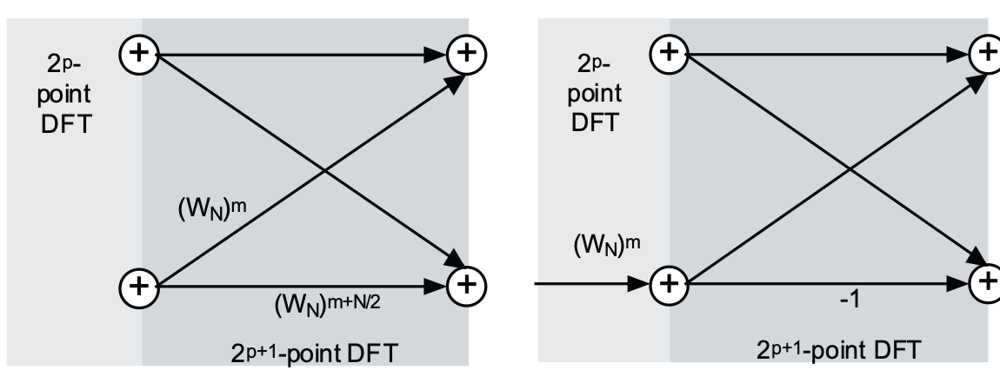
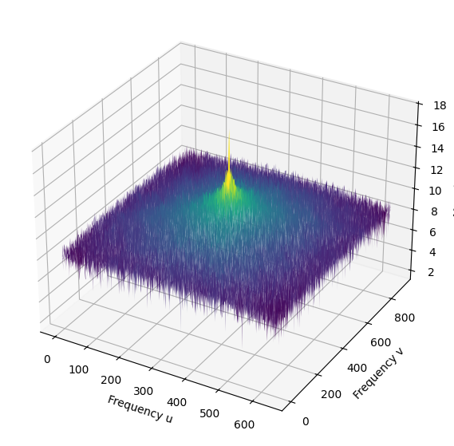
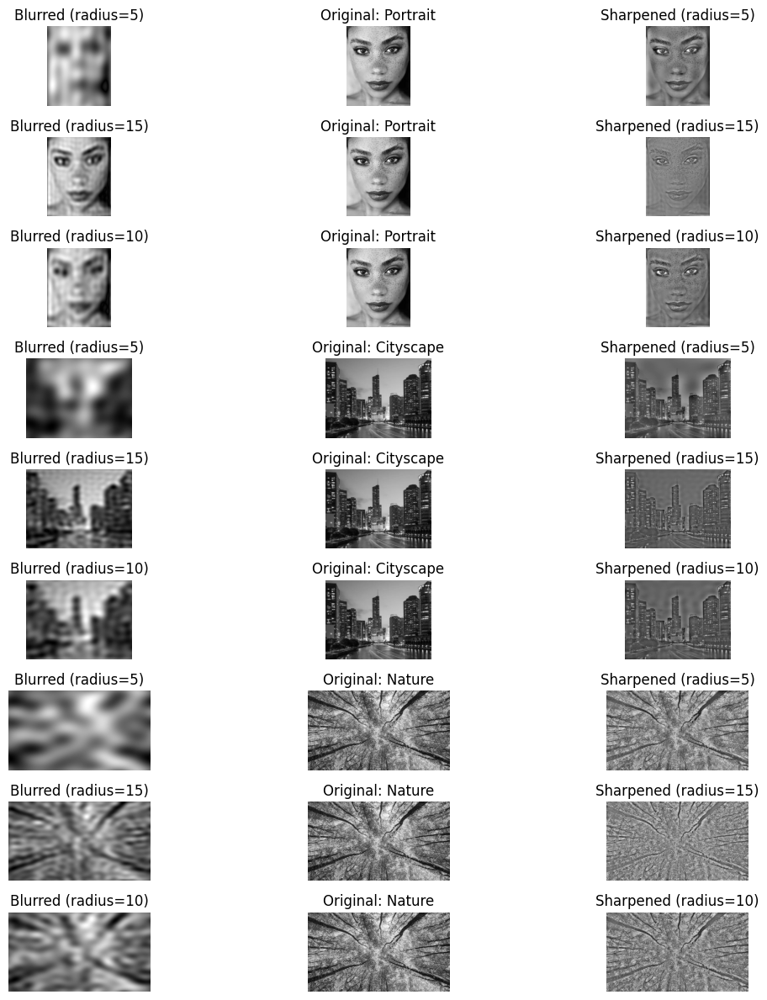
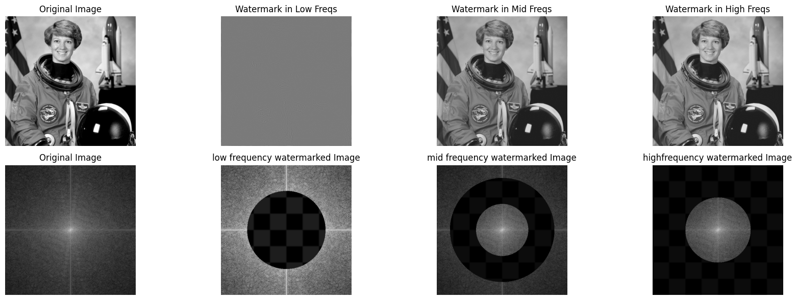

## Mohammad Bagher Mahdizadeh
## mhdz.m@outlook.com

## Overview

- Introduction and mathematical definitions
- Fast Fourier Transform
- Working with images
- Blured and sharpen images
- Hidden watermark

## First things, first

### Definitions

**Definition**: DFT (Discrete Fourier Transform), assume $x(n)$ is a discrete signal and $N > 0$. Then

$$
X(k) = \sum_{n = 0}^{N - 1} e^{\frac{-2\pi i n k}{N}}
$$

where $0 \leq k < N$.
The above equation is also called the **analysis** equation for the DFT.

---

**Example**: Find 8-point DFT of $\delta(t)$.

Solution:

$$
S(k) = \sum_{n = 0}^{7} \delta(n) e^{\frac{-2\pi i n k}{8}}
= \delta(0) = 1
$$

---

**Example**: Find 6-point DFT of $x(n) = [1, 2, 3, 0, 0, 0]$.

Solution:

$$
X(k) = \sum_{n = 0}^{5} x(n)e^{\frac{-2\pi i n k}{N}}
= \sum_{n = 0}^{2} x(n)e^{\frac{-2\pi i n k}{N}}
= 1 + 2 e^{\frac{-\pi i k}{3}} + 3 e^{\frac{-2\pi i k}{3}}
$$

It’s obvious that if $x(n)$ was a periodic signal with $T = N$, then we can have $X(k)$ not just for $0 \leq k < N$ but $\forall k$.

---

**Definition**: **IDFT (Inverse DFT)** is defined as below:

For $X(k)$, $0 \leq k < N$,

$$
0 \leq n < N
$$
$$
\frac{1}{N}\sum_{k = 0}^{N - 1} X(k) e^{\frac{2\pi i n k}{N}}
$$

It is also called the **synthesis** equation of the DFT.


### Properties

Now, being familiar with analysis and synthesis equations we are ready to investigate their basic properties.
- **shift in time**:
$$
\text{for x and y being periodic signals with T = N}
$$
$$
X(k) = \Sigma_{n = 0}^{N - 1}x(n)e^{\frac{-2\pi n i k}{N}}
$$
$$
y(n) = x(n - l) \Rightarrow Y(k) = \Sigma_{n = 0}^{N - 1}x(n - l)e^{\frac{-2\pi n i k}{N}}
$$
$$
    \text{assume }\quad m = n - l \Rightarrow Y(k) = \Sigma_{m = -l}^{N - l - 1}x(m)e^{\frac{-2\pi (m + l) i k}{N}}
$$
$$
    \text{x and the exponent are periodic with T = N, so we can change the range of sum to }\quad (0, N-1)\quad \text{again}
$$
$$
    Y(k) = e^{\frac{-2\pi i l n}{N}}\Sigma_{m = 0}^{N - 1}x(m)e^{\frac{-2\pi m i k}{N}}
$$
- **Shift in frequency domain**:
Let \(x[n]\) be a discrete signal of length \(N\) and \(X[k]\) its DFT:

$$
X[k] = \sum_{n=0}^{N-1} x[n] e^{-j \frac{2\pi}{N} k n}, \quad k = 0,1,\dots,N-1
$$

Consider multiplying \(x[n]\) by a complex exponential  \ $(e^{j \frac{2\pi}{N} m_0 n} $\):

$$
y[n] = x[n] \cdot e^{j \frac{2\pi}{N} m_0 n}
$$

The DFT of \(y[n]\) is:

$$
Y[k] = \sum_{n=0}^{N-1} y[n] e^{-j \frac{2\pi}{N} k n}
$$


Substitute \(y[n]\):

$$
Y[k] = \sum_{n=0}^{N-1} x[n] e^{j \frac{2\pi}{N} m_0 n} e^{-j \frac{2\pi}{N} k n}
$$


Combine exponents:

$$
Y[k] = \sum_{n=0}^{N-1} x[n] e^{-j \frac{2\pi}{N} (k - m_0) n}
$$


Therefore:

$$
Y[k] = X\big[(k - m_0) \bmod N\big]
$$


Multiplying a signal by \(e^{j 2 \pi m_0 n / N} \) in the time domain corresponds to a circular shift of \(m_0\) in the frequency domain.


### Convolution

before we start analysing this function and its relation with DFT, we should note that original definition of convolution will not converge for general periodic signal, so we present a modified version of the function:

 

**Periodic Convolution**:


Suppose x(n) and y(n) are periodic siganls with main period of \( T_0 = N \)

$$
x(n) * y(n) = \Sigma_{k = 0}^{N - 1}x(k)y(n - k)
$$

**Convolution in time**:


Let \(x[n]\) and \(h[n]\) be sequences of length \(N\). Define their circular convolution:

$$
y[n] = (x * h)[n] = \sum_{m=0}^{N-1} x[m] h[(n-m) \bmod N]
$$


The DFT of \(y[n]\) is:

$$
Y[k] = \sum_{n=0}^{N-1} y[n] e^{-j \frac{2 \pi}{N} k n}
$$


Substitute \(y[n]\) into the sum:

$$
Y[k] = \sum_{n=0}^{N-1} \left( \sum_{m=0}^{N-1} x[m] h[(n-m) \bmod N] \right) e^{-j \frac{2 \pi}{N} k n}
$$


Swap the order of summation:

$$
Y[k] = \sum_{m=0}^{N-1} x[m] \sum_{n=0}^{N-1} h[(n-m) \bmod N] \, e^{-j \frac{2 \pi}{N} k n}
$$


Change the summation variable: let \(r = (n-m) \bmod N \implies n = r+m\). Then

$$
Y[k] = \sum_{m=0}^{N-1} x[m] \sum_{r=0}^{N-1} h[r] \, e^{-j \frac{2 \pi}{N} k (r+m)}
$$


Split the exponential:

$$
Y[k] = \sum_{m=0}^{N-1} x[m] e^{-j \frac{2 \pi}{N} k m} \sum_{r=0}^{N-1} h[r] e^{-j \frac{2 \pi}{N} k r}
$$


Recognize the DFTs:

$$
Y[k] = \underbrace{\sum_{m=0}^{N-1} x[m] e^{-j \frac{2 \pi}{N} k m}}_{X[k]} \cdot \underbrace{\sum_{r=0}^{N-1} h[r] e^{-j \frac{2 \pi}{N} k r}}_{H[k]}
$$


Finally, we have:

$$
\boxed{Y[k] = X[k] \cdot H[k]}
$$


**Conclusion:** Circular(periodic) convolution in time corresponds to multiplication in frequency.

**Periodic Convolution in Frequency domain**:

$$
\text{Let } x(t) \text{ and } y(t) \text{ be two } T\text{-periodic signals with Fourier series:}
$$
$$
x(t) = \sum_{k=-\infty}^{\infty} X[k] e^{j k \omega_0 t}, \quad
y(t) = \sum_{k=-\infty}^{\infty} Y[k] e^{j k \omega_0 t}, \quad \omega_0 = \frac{2\pi}{T}
$$

$$
\text{The convolution in frequency domain is defined as:}
$$

$$
Z[k] = (X * Y)[k] = \sum_{m=-\infty}^{\infty} X[m] Y[k-m]
$$

$$
\text{Construct the time-domain signal corresponding to } Z[k]:
$$

$$
z(t) = \frac{1}{N} \sum_{k=-\infty}^{\infty} Z[k] e^{j k \omega_0 t}
$$

$$
\text{Substitute } Z[k] \text{ by the convolution:}
$$

$$
z(t) =\frac{1}{N} \sum_{k=-\infty}^{\infty} \left( \sum_{m=-\infty}^{\infty} X[m] Y[k-m] \right) e^{j k \omega_0 t}
$$

$$
\text{Change the order of summation:}
$$

$$
z(t) =\frac{1}{N} \sum_{m=-\infty}^{\infty} X[m] \sum_{k=-\infty}^{\infty} Y[k-m] e^{j k \omega_0 t}
$$

$$
\text{Let } n = k - m \implies k = n + m
$$

$$
z(t) =\frac{1}{N} \sum_{m=-\infty}^{\infty} X[m] \sum_{n=-\infty}^{\infty} Y[n] e^{j (n+m) \omega_0 t}
$$
$$
z(t) =\frac{1}{N} \sum_{m=-\infty}^{\infty} X[m] e^{j m \omega_0 t} \sum_{n=-\infty}^{\infty} Y[n] e^{j n \omega_0 t}
$$
$$
z(t) = \left( \sum_{m=-\infty}^{\infty} X[m] e^{j m \omega_0 t} \right)
       \left( \sum_{n=-\infty}^{\infty} Y[n] e^{j n \omega_0 t} \right)
$$
$$
\text{Therefore, } z(t) = N x(t) \cdot y(t)
$$
$$
\text{Hence, convolution in frequency domain corresponds to multiplication in time domain.}
$$


## FFT

Considering DFT analysis equation it's obvious that bruteforce algorithm of calculating n-point DFT has \( n^2 \) time complexity. There is a serious focus on implementing this transformation in more optimized way, such as some special propose circuits that may take use of systolic arrays. In this section I'll explain an approach which is of O(nlgn) but limited to certain type of DFT.

if the n in n-point DFT, is a power of 2 then we can use Divide and Conquer approach to devise an algorithm with time complexity of O(nlgn). There are two main divide method:
$$
\text{Decimation in}
\begin{cases}
Time  & \text{} \\
Frequency & \text{}
\end{cases}
$$

**Decimation in time**:Decimation-in-time FFT algorithms reduce the
DFT into a succession of smaller and smaller DFT analysis equation calculations.
This works best when N = 2p for some p ∈ Z. The N-point DFT computation resolves
into two (N/2)-point, each of which resolves into two (N/4)-point DFTs, and so on.

$$
    X(w) = \Sigma_{n = 0}^{N -1}x(n)e^{\frac{-2\pi i k n}{N}}
$$
By deviding these equation into two parts, one consisting only of $ n \in O$ and other one $n \in E$.

$$
X(k) = \sum_{m=0}^{\frac{N}{2}-1} x(2m) W_N^{2km}
     + \sum_{m=0}^{\frac{N}{2}-1} x(2m+1) W_N^{(2m+1)k}
$$

$$
= \sum_{m=0}^{\frac{N}{2}-1} x(2m) W_N^{2km} +
W_N^k \sum_{m=0}^{\frac{N}{2}-1} x(2m+1) W_N^{2km}
$$
Note that \W\ is defined as $ W_N = e^{\frac{-2\pi i }{N}}$

$$
W_N^{2}
= e^{\frac{-4\pi i}{N}}
= e^{\frac{-2\pi i}{\tfrac{N}{2}}}
= W_{\tfrac{N}{2}}
$$
and then we have:

$$
X(k) = \sum_{m=0}^{\frac{N}{2}-1} x(2m) W_{\frac{N}{2}}^{km}
     + W_N^k\sum_{m=0}^{\frac{N}{2}-1} x(2m+1) W_{\frac{N}{2}}{(mk)}
$$
 By assuming \( y(m) = x(2m) \)  and \( z(m) = x(2m + 1) \) we get

$$
    X(w) = Y(w) + W_N^kZ(w)
$$

Now we have obtained an approach with time complexity of \( O(nlogn) \).


There are two very useful points which are worth noting:

**The multiplying factor**, each term which is multiplied by $ W_N^m $ is multiplied by $ W_N^{(m + \frac{N}{2})} $  too. If we get this ratio we find $W_N^{\frac{N}{2}} = -1$





**Butterflies**: Now let us consider the rearrangement of the original signal values \( x(0), x(1),
x(2), x(3), x(4), x(5), x(6), x(7) \) into the proper order for the four initial butterflies:
\( x(0), x(4), x(2), x(6), x(1), x(5), x(3), x(7) \). This represents a bit-reversed reading of
the indices of the data, because we observe that if the indices of the signal values are
written in binary form, that is, \( x(0) = x(000), x(1) = x(001) \), and so on, then the nec-
essary rearrangement comes from reading the binary indices backwards: \(  x(000),
x(100), x(010), x(110), x(001), x(101), x(011), x(111) \).

By applying this changes we can Compute n-point DFT of an n-point sample **inplace**.

```latex
#include <cmath>
#include<iostream>
#include <vector>
#define PI 3.14159265358979
#include <complex> //ISO/ANSI std template library
using namespace std;
int fft(complex<double> *x, int nu)
{ // sanity check to begin with:
    if (x == NULL || nu <= 0)
        return 0;
    int N = 1 << nu; int halfN = N >> 1; //N=2**nu
//N/2
    complex<double> temp, u, v;
    int i, j, k;
    for (i = 1, j = 1; i < N; i++){ //bit-reversing data:
        if (i < j){ temp = x[j-1]; x[j-1] = x[i-1]; x[i-1] = temp;}
        k = halfN;
        while (k < j){j -= k; k >>= 1;}
        j += k;
    }
    int mu, M, halfM, ip;
    double omega;
    for (mu = 1; mu <= nu; mu++) {
        M = 1 << mu; // M = 2**mu
        halfM = M >> 1; // M/2
        u = complex<double>(1.0, 0.0);
        omega = PI/(double)halfM;
        auto w = complex<double>(cos(omega), -sin(omega));
        for (j = 0; j < halfM;j++){
            for (i = j; i < N; i += M){
                ip = i + halfM;
                temp = x[ip]*u;
                x[ip] = x[i] - temp;
                x[i] += temp;
            }
            u *= w;
        }
        u *= w;
    }
    return 1;
}
```


## Fourier of Images!

Before applying Fourier-based tricks such as blurring, sharpening, or compression, it is useful to see what the Fourier Transform of an image looks like. The 2D Fourier Transform represents the image in terms of its frequency components:

- The low frequencies (near the center after shifting) capture smooth variations such as lighting and large shapes.

- The high frequencies (towards the edges) capture fine details, edges, and textures.
By visualizing the Fourier spectrum, we can literally “see” which parts of the image correspond to overall structure and which correspond to details. This understanding is key for why filtering in the frequency domain works so effectively.

When we apply the Fourier Transform to an image, we move from the spatial domain (pixels) to the frequency domain. This new representation tells us how much of each frequency is present in the image. However, a few “tricks” are important to understand before we use Fourier for filtering:

- **Shift vs. No Shift**: By default, NumPy places the zero frequency (the DC component, or average brightness) at the top-left corner of the spectrum. For humans, it is much more intuitive to see it at the center, which is why we often apply fftshift. After shifting, the low frequencies gather in the middle, while high frequencies spread toward the edges.

- **Magnitude vs. Phase**: The Fourier result is complex. Most of the “energy” of the image lies in the magnitude, while the phase preserves structural alignment. For visualization, we usually plot the magnitude on a log scale.

- **Real vs. Complex Output**: Inverse FFT of a real image should also be real, but due to numerical round-off, tiny imaginary values appear. That is why we often take np.real() or np.abs() when reconstructing images.


```python
import numpy as np
import matplotlib.pyplot as plt
from PIL import Image
from numpy import dtype
from sympy.codegen.ast import uint8

img = Image.open('resources/astronout.webp').convert('L')  # 'L' mode = grayscale
img = np.array(img, dtype=float) / 255.0       # normalize to 0-1

# Compute 2D Fourier Transform
f = np.fft.fft2(img)

# Without shift
magnitude_no_shift = np.log(1 + np.abs(f))

# With shift
fshift = np.fft.fftshift(f)
magnitude_shift = np.log(1 + np.abs(fshift))

# Plot
fig, axes = plt.subplots(1, 3, figsize=(15, 5))

axes[0].imshow(img, cmap='gray')
axes[0].set_title("Original Image")
axes[0].axis("off")

axes[1].imshow(magnitude_no_shift, cmap='gray')
axes[1].set_title("Fourier Spectrum (No Shift)")
axes[1].axis("off")

axes[2].imshow(magnitude_shift, cmap='gray')
axes[2].set_title("Fourier Spectrum (With Shift)")
axes[2].axis("off")

plt.show()

```


    

    


```python
from matplotlib import cm
from numpy.fft import fftshift, fft2

image = Image.open('./DFTanditsApplications/resources/astronout.jpg').convert('L')

# Compute 2D FFT and shift zero frequency to center
F = fftshift(fft2(image))
magnitude = np.log(1 + np.abs(F))

# Create frequency coordinates
M, N = F.shape
u = np.arange(M)
v = np.arange(N)
U, V = np.meshgrid(v, u)

# 3D plot
fig = plt.figure(figsize=(10, 7))
ax = fig.add_subplot(111, projection='3d')
ax.plot_surface(U, V, magnitude, cmap=cm.viridis)
ax.set_xlabel('Frequency u')
ax.set_ylabel('Frequency v')
ax.set_zlabel('Magnitude')
plt.show()

```


    

    


## Image Blurring and Sharpening with Fourier Transform, Texture and roughness

In the spatial domain, image blurring and sharpening are usually achieved with convolution filters. However, by moving to the frequency domain using the Fourier Transform, these operations can be understood in terms of filtering different frequency components of the image. A blurred image is obtained by suppressing high-frequency details (edges and fine textures), while sharpening is achieved by emphasizing them. This approach highlights one of the most powerful aspects of the Fourier Transform: it allows us to directly manipulate the frequency content of an image to achieve intuitive and visually significant results.

**high frequency** components defines textures and repid changes involving noises etc.

**low frequency** elements usually defines the smoothness of the picture.

As you will see, most data which is necessary to recognize an image resides in low frequencies.


```python
#loading images

portrait = Image.open('resources/portrait.jpeg').convert('L')
city = Image.open('resources/cityScape.png.webp').convert('L')
nature = Image.open('resources/nature.jpeg').convert('L')
```


```python
import numpy as np

import numpy as np

import numpy as np

def blur_with_fft(img, radius):
    """
    Apply FFT-based blur (low-pass filter) to an image.

    Parameters:
        img (2D numpy array): grayscale image
        radius (int): radius of the low-pass filter (in frequency domain)
    Returns:
        img_back (2D numpy array): blurred image
    """
    # Compute FFT
    IMG = np.fft.fft2(img)
    fshift = np.fft.fftshift(IMG)

    # Create a low-pass circular mask
    rows, cols = IMG.shape
    crow, ccol = rows // 2, cols // 2  # center
    mask = np.zeros((rows, cols), dtype=np.uint8)
    y, x = np.ogrid[:rows, :cols]
    mask_area = (x - ccol)**2 + (y - crow)**2 <= radius*radius
    mask[mask_area] = 1

    # Apply mask in frequency domain
    fshift_filtered = fshift * mask

    # Inverse FFT to reconstruct the image
    f_ishift = np.fft.ifftshift(fshift_filtered)
    img_back = np.fft.ifft2(f_ishift)
    img_back = np.abs(img_back)

    return img_back


def sharpen_with_fft(img, radius, k=5):

    # Compute FFT
    IMG = np.fft.fft2(img)
    fshift = np.fft.fftshift(IMG)

    rows, cols = IMG.shape
    crow, ccol = rows // 2, cols // 2  # center
    mask = np.ones((rows, cols), dtype=np.uint8)
    y, x = np.ogrid[:rows, :cols]
    mask_area = (x - ccol)**2 + (y - crow)**2 >= radius*radius
    mask[mask_area] = k
    fshift *= mask

    # Inverse FFT
    img_back = np.fft.ifft2(np.fft.ifftshift(fshift))
    img_back = np.real(img_back)

    # Normalize to original image range
    """ img_back -= img_back.min()
    if img_back.max() != 0:
        img_back = img_back / img_back.max()
    img_back = (img_back * 255).astype(np.uint8) """

    return img_back


```


```python
import matplotlib.pyplot as plt

def show_blur_sharp_results(images, thresholds):
    """
    images: list of (title, image_array)
    thresholds: list of threshold values for blurring/sharpening
    """
    rows = len(images) * len(thresholds)   # different thresholds
    cols = 3  # blurred, normal, sharpened
    fig, axes = plt.subplots(rows, cols, figsize=(12, 4 * len(images)))


    if rows == 1:
        axes = [axes]
    else:
        axes = axes.reshape(rows, cols)

    row_idx = 0
    for img_title, img in images:
        for t in thresholds:
            img = np.array(img, dtype=float) / 255.0
            blurred = blur_with_fft(img, t)
            sharpened = sharpen_with_fft(img, t)


            # Plot blurred
            axes[row_idx, 0].imshow(blurred, cmap='gray')
            axes[row_idx, 0].set_title(f"Blurred (radius={t})")
            axes[row_idx, 0].axis("off")

            # Plot original
            axes[row_idx, 1].imshow(img, cmap='gray')
            axes[row_idx, 1].set_title(f"Original: {img_title}")
            axes[row_idx, 1].axis("off")

            # Plot sharpened
            axes[row_idx, 2].imshow(sharpened, cmap='gray')
            axes[row_idx, 2].set_title(f"Sharpened (radius={t})")
            axes[row_idx, 2].axis("off")

            row_idx += 1

    plt.tight_layout()
    plt.show()

```


```python
# Example usage (assuming you have 3 images already loaded as grayscale arrays)

images = [
    ("Portrait", portrait),
    ("Cityscape", city),
    ("Nature", nature)
]


thresholds = [5, 15, 10]  # example cutoff values

show_blur_sharp_results(images, thresholds)

```


    

    


Here we used rough filters, the blur function is actually a ideal lowpass filter. But in reality such filters are not exist and applying this function to an image results in Gibbs phenomenon.

## Hidden Watermarks

Digital watermarking is the process of embedding hidden information (such as a logo, text, or pattern) into an image in a way that is not easily noticeable to the human eye but can still be recovered later. In the frequency domain, this becomes especially powerful. The Fourier Transform lets us modify specific ranges of frequencies:

- If we embed the watermark in the low frequencies, it becomes very robust (harder to remove), but it may visibly distort the image.

- If we embed it in the high frequencies, it is less noticeable but can be destroyed by compression or blurring.

- A common compromise is to embed in the mid-frequency range, where it is both subtle and somewhat resilient.

Mathematically, we compute the Fourier transform of the image, add a scaled version of the watermark pattern to selected frequency components, and then apply the inverse Fourier transform to reconstruct the watermarked image. This simple procedure illustrates how the frequency domain can be used not only for filtering but also for embedding hidden information inside images.

**Skimage**: scikit-image is a collection of algorithms for image processing. It is available free of charge and free of restriction. We pride ourselves on high-quality, peer-reviewed code, written by an active community of volunteers.


```python
from skimage import data, color, transform
```


```python
def fft_util(img):
    f = np.fft.fft2(img)
    fshift = np.fft.fftshift(f)
    return fshift

def embed_watermark(img, watermark, strength=0.1, mode="mid"):
    rows, cols = img.shape
    f = np.fft.fft2(img)
    fshift = np.fft.fftshift(f)

    # Resize watermark to match image size
    wm_resized = transform.resize(watermark, (rows, cols), anti_aliasing=True)

    # Decide frequency mask
    Y, X = np.ogrid[:rows, :cols]
    crow, ccol = rows // 2, cols // 2
    dist = np.sqrt((X - ccol)**2 + (Y - crow)**2)

    if mode == "low":
        mask = dist < min(rows, cols) * 0.3
    elif mode == "mid":
        mask = (dist >= min(rows, cols) * 0.2) & (dist <= min(rows, cols) * 0.4)
    elif mode == "high":
        mask = dist > min(rows, cols) * 0.25
    else:
        raise ValueError("Mode must be 'low', 'mid', or 'high'")

    # Embed watermark (scaled and masked)
    fshift_watermarked = fshift * ~mask + wm_resized * mask * strength


    # Inverse FFT
    f_ishift = np.fft.ifftshift(fshift_watermarked)
    img_watermarked = np.fft.ifft2(f_ishift)

    return np.real(img_watermarked)

astronaut1 = color.rgb2gray(data.astronaut())
camera = data.checkerboard()

# Apply watermark in different frequency regions
wm_low  = embed_watermark(astronaut1, camera, strength= 0.8, mode="low")
wm_mid  = embed_watermark(astronaut1, camera, strength=0.8, mode="mid")
wm_high = embed_watermark(astronaut1, camera, strength=0.8, mode="high")

# Plot results
fig, axes = plt.subplots(2, 4, figsize=(18, 6))

axes[0, 0].imshow(astronaut1, cmap='gray')
axes[0, 0].set_title("Original Image")
axes[0, 0].axis("off")

axes[0, 1].imshow(wm_low, cmap='gray')
axes[0, 1].set_title("Watermark in Low Freqs")
axes[0, 1].axis("off")

axes[0, 2].imshow(wm_mid, cmap='gray')
axes[0, 2].set_title("Watermark in Mid Freqs")
axes[0, 2].axis("off")

axes[0, 3].imshow(wm_high, cmap='gray')
axes[0, 3].set_title("Watermark in High Freqs")
axes[0, 3].axis("off")


axes[1, 0].imshow(np.log(1 + np.abs(fft_util(astronaut1))), cmap='gray')
axes[1, 0].set_title("Original Image")
axes[1, 0].axis("off")


axes[1, 1].imshow(np.log(1 + np.abs(fft_util(wm_low))), cmap='gray')
axes[1, 1].set_title("low frequency watermarked Image")
axes[1, 1].axis("off")


axes[1, 2].imshow(np.log(1 + np.abs(fft_util(wm_mid))), cmap='gray')
axes[1, 2].set_title("mid frequency watermarked Image")
axes[1, 2].axis("off")

axes[1, 3].imshow(np.log(1 + np.abs(fft_util(wm_high))), cmap='gray')
axes[1, 3].set_title("highfrequency watermarked Image")
axes[1, 3].axis("off")

plt.tight_layout()
plt.show()

```


    

    


Due to symmetry of DFT coefficients, using a asymmetric image as watermark will result in losing information when going back to frequency domain.
Again you can see most detail of an image which our eyes can observe is in the low frequency components.

## Sources

- Signal analysis. Time, frequency, scale and structure 2004.pdf
- https://scikit-image.org
- https://www.jeremykun.com/2013/12/30/the-two-dimensional-fourier-transform-and-digital-watermarking/
- https://www.youtube.com/watch?v=YglN_4tJoOU
- https://www.cs.unm.edu/~brayer/vision/fourier.html
