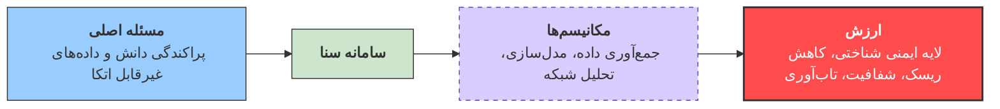
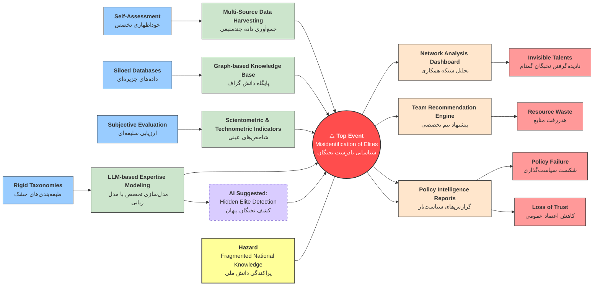

این سامانه به ارائه یک تحلیل سیستماتیک می‌پردازد؛ سامانه‌ای که با هدف شناسایی، ارزیابی و شبکه‌سازی نخبگان علمی و فناورانه کشور بر پایه داده‌های عینی و چندمنبعی طراحی شده است. در این چارچوب، خطر اصلی به‌صورت پراکندگی و غیرقابل اتکا بودن دانش تخصصی ملی تعریف شده و رویداد محوری، شناسایی نادرست یا ناقص نخبگان واقعی در سطح حاکمیتی در نظر گرفته می‌شود. تحلیل نشان می‌دهد که انحرافاتی نظیر اتکای بیش از حد به خوداظهاری، داده‌های جزیره‌ای و ارزیابی‌های سلیقه‌ای می‌توانند منجر به شکست تصمیم‌گیری شود و و هدررفت منابع ملی شوند. سامانه سنا با به‌کارگیری موانع پیشگیرانه‌ای شامل جمع‌آوری خودکار داده‌های چندمنبعی، مدل‌سازی تخصص مبتنی بر مدل‌های زبانی، شاخص‌های علم‌سنجی و پایگاه دانش گراف، و همچنین موانع کاهنده‌ای نظیر تحلیل شبکه و گزارش‌های سیاست‌یار، نقش یک لایه ایمنی شناختی را ایفا می‌کند. نتایج این تحلیل نشان می‌دهد که سنا فراتر از یک ابزار اطلاعاتی، یک زیرساخت ایمنی دانش برای کاهش ریسک تصمیم‌گیری، افزایش شفافیت و ارتقای تاب‌آوری حکمرانی علم و فناوری در کشور محسوب می‌شود.

```mermaid
graph LR
    style graph font-family: "Vazir", sans-serif
    style node font-family: "Vazir", sans-serif
    P["مسئله: پراکندگی دانش و داده‌های غیرقابل اتکا"] --> S["سامانه سنا: جمع‌آوری داده، مدل‌سازی، تحلیل شبکه"]
    S --> V["ارزش: لایه ایمنی شناختی، کاهش ریسک، شفافیت، تاب‌آوری"]
    style P fill:#99ccff,stroke:#333
    style S fill:#cce5cc,stroke:#333
    style V fill:#ff4d4d,stroke:#333,stroke-width:2px,color:#fff
```


## هدف مطالعه و دامنه کاربرد  

این سند به ارائه یک تحلیل بوتای مبتنی بر رویکرد مطالعه خطر و قابلیت بهره‌برداری برای طرح «سنا» می‌پردازد. سامانه «سنا» یک سیستم اجتماعی–فنی  و دانش‌محور است که با بهره‌گیری از هوش مصنوعی  به شناسایی، رتبه‌بندی و شبکه‌سازی نخبگان علمی و فناورانه کشور می‌پردازد.

در این تحلیل، برخلاف کاربردهای کلاسیک  در صنایع فرایندی، «خطر» به‌صورت **خطر تصمیم‌گیری نادرست در سطح حاکمیتی** تعریف می‌شود؛ خطری که می‌تواند منجر به اتلاف منابع، شکست سیاست‌گذاری و تضعیف اعتماد عمومی گردد.


##  شناسایی خطر  

### گره مطالعه   
**فرآیند ملی شناسایی و مدیریت دانش و تخصص**  
*(National Expertise Identification and Knowledge Management Process)*

### خطر (Hazard)  
**پراکندگی، عدم شفافیت و غیرقابل اتکا بودن دانش تخصصی ملی**  

این خطر نشان‌دهنده وجود سرمایه انسانی ارزشمند به‌صورت **پنهان، جزیره‌ای و غیرقابل مشاهده** است که قابلیت بهره‌برداری مؤثر از آن وجود ندارد.

---

## 3. تحلیل انحرافات با واژه‌های راهنمای HAZOP  
*(Deviation Analysis using HAZOP Guidewords)*

| واژه راهنما (Guideword) | انحراف (Deviation)                                                         |
| ----------------------- | -------------------------------------------------------------------------- |
| **More**                | اتکای بیش از حد به خوداظهاری تخصص *(Excessive Self-Assessment)*            |
| **Less**                | استفاده ناکافی از شاخص‌های کمی و عینی *(Insufficient Objective Indicators)* |
| **As Well As**          | تأثیر روابط غیررسمی بر انتخاب نخبگان *(Informal Influence Networks)*       |
| **Other Than**          | جایگزینی طبقه‌بندی‌های خشک به جای تخصص واقعی *(Rigid Taxonomies)*            |
| **No**                  | نبود دید شبکه‌ای از تعاملات و همکاری‌ها *(Lack of Network Visibility)*       |

این انحرافات باعث **کاهش قابلیت بهره‌برداری (Loss of Operability)** سیستم می‌شوند.


## 4. رویداد محوری (Top Event)  
*(Loss of Control Event)*

### رویداد محوری – Top Event  
**شناسایی نادرست یا ناقص نخبگان واقعی**  
*(Misidentification or Incomplete Identification of Real Elites)*

در منطق HAZOP، این رویداد معادل **از دست رفتن کنترل فرآیند (Loss of Process Control)** است؛ جایی که سیستم قادر به تمایز معتبر میان افراد تأثیرگذار و غیرتأثیرگذار نیست.

---

## 5. تهدیدها (Threats) – سمت چپ BowTie  
*(Causes – Left Side of the BowTie)*

تهدیدهای اصلی که می‌توانند منجر به وقوع Top Event شوند عبارت‌اند از:

- **وابستگی به خوداظهاری (Self-Assessment Dependency)**  
- **وجود پایگاه‌های داده جزیره‌ای (Siloed Databases)**  
- **ارزیابی‌های سلیقه‌ای و انسانی (Subjective Evaluation)**  
- **طبقه‌بندی‌های دانش ایستا و غیرپویا (Rigid Knowledge Classification)**  

این عوامل احتمال وقوع رویداد محوری را به‌شدت افزایش می‌دهند.

---

## 6. موانع پیشگیرانه (Preventive Barriers)  
*(Preventive Safeguards / Controls)*

سامانه «سنا» مجموعه‌ای از **کنترل‌های پیشگیرانه (Preventive Controls)** را برای مهار تهدیدها ارائه می‌دهد:

- **جمع‌آوری خودکار داده‌های چندمنبعی**  
  *(Multi-Source Automated Data Harvesting)*

- **شاخص‌های علم‌سنجی و فناوری‌سنجی عینی**  
  *(Scientometric & Technometric Indicators)*

- **مدل‌سازی تخصص مبتنی بر مدل‌های زبانی بزرگ**  
  *(LLM-Based Expertise Modeling)*

- **پایگاه دانش مبتنی بر گراف**  
  *(Graph-Based Knowledge Repository)*

- **کشف نخبگان پنهان توسط هوش مصنوعی**  
  *(AI-Based Hidden Elite Detection)*

این موانع به‌طور مستقیم انحرافات HAZOP را کنترل کرده و مانع رسیدن سیستم به Top Event می‌شوند.

---

## 7. پیامدها (Consequences) – سمت راست BowTie  
*(Consequences – Right Side of the BowTie)*

در صورت شکست موانع پیشگیرانه، پیامدهای زیر محتمل خواهند بود:

- **هدررفت منابع تحقیق و توسعه ملی**  
  *(National R&D Resource Waste)*

- **نادیده‌گرفتن نخبگان گمنام ولی مؤثر**  
  *(Invisible but High-Impact Elites)*

- **شکست سیاست‌گذاری علم و فناوری**  
  *(Science & Technology Policy Failure)*

- **کاهش اعتماد عمومی به نهادهای حاکمیتی**  
  *(Erosion of Public Trust)*

---

## 8. موانع کاهنده پیامد (Mitigative Barriers)  
*(Mitigation and Recovery Barriers)*

برای کاهش شدت اثرات پس از وقوع Top Event، سامانه سنا موانع کاهنده زیر را فراهم می‌کند:

- **داشبورد تحلیل شبکه همکاری‌ها**  
  *(Network Analysis Dashboards)*

- **موتور پیشنهاد تیم‌های تخصصی**  
  *(Expert Team Recommendation Engine)*

- **گزارش‌های سیاست‌یار و تحلیل شکاف فناوری**  
  *(Policy Intelligence & Gap Analysis Reports)*

این موانع به **بازیابی کنترل (Recovery of Operability)** کمک می‌کنند.

---

## 9. نقش هوش مصنوعی به‌عنوان لایه ایمنی شناختی  
*(AI as a Cognitive Safety Layer)*

در چارچوب HAZOP–BowTie، هوش مصنوعی در طرح «سنا» نقش یک **لایه ایمنی شناختی (Cognitive Safety Barrier)** را ایفا می‌کند؛ مشابه **کنترل پیشرفته فرآیند (Advanced Process Control – APC)** در صنایع فرایندی.

AI:
- جایگزین قضاوت انسانی نیست،
- بلکه شفافیت، قابلیت ردیابی و انسجام تصمیم‌ها را افزایش می‌دهد،
- و عدم قطعیت در سیستم‌های پیچیده دانش‌محور را کاهش می‌دهد.

---

## 10. جمع‌بندی  
*(Conclusion)*

تحلیل HAZOP مبتنی بر BowTie نشان می‌دهد که سامانه «سنا»:

- یک **خطر ملی قابل‌تعریف** را هدف قرار داده است،
- با ایجاد موانع پیشگیرانه و کاهنده، ریسک تصمیم‌گیری نادرست را کاهش می‌دهد،
- و فرآیند شناسایی نخبگان را از یک فعالیت ذهنی و سلیقه‌ای به یک **سیستم کنترل‌شده، ممیزی‌پذیر و تاب‌آور** تبدیل می‌کند.

در نتیجه، «سنا» نه صرفاً یک سامانه اطلاعاتی، بلکه یک **زیرساخت ایمنی دانش (Knowledge Safety Infrastructure)** برای حکمرانی هوشمند در اکوسیستم نوآوری کشور محسوب می‌شود.


# 🔥 Top Event (رویداد محوری)

