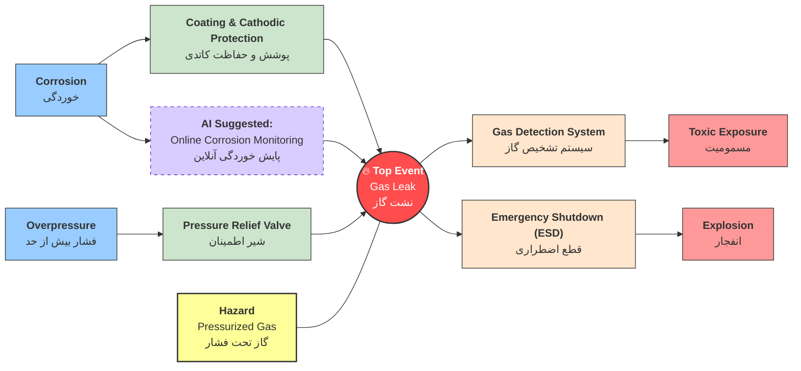
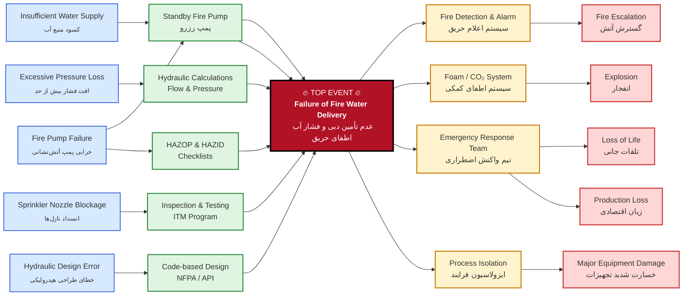
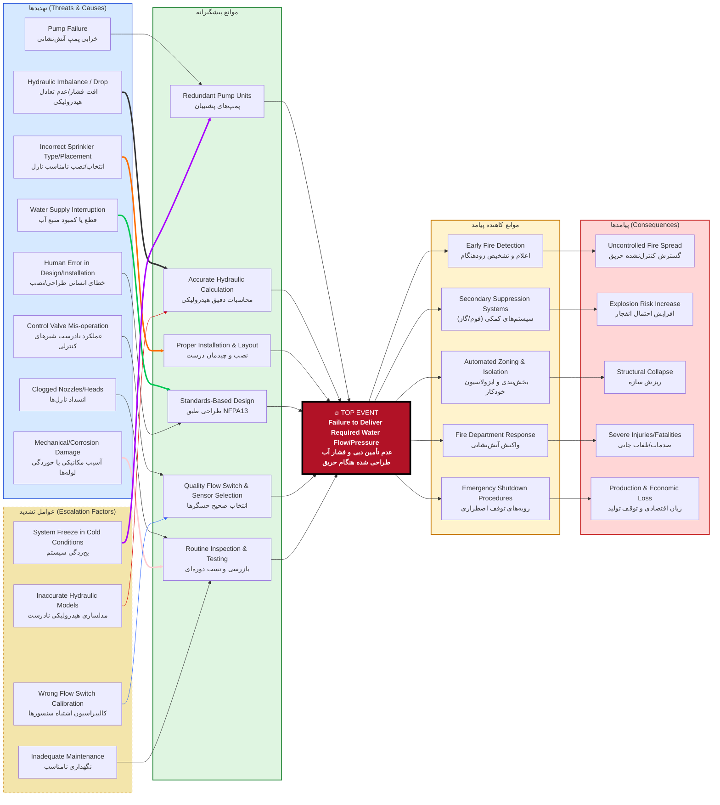

روش پاپیونی (Bow-Tie) یکی از تکنیک‌های قدرتمند و کاربردی در حوزه مدیریت ریسک است که به صورت گسترده در صنایع مختلف برای شناسایی، ارزیابی و کنترل خطرات استفاده می‌شود. این روش که ایده اولیه آن در سال ۱۹۷۹ در دانشگاه کوئینزلند استرالیا مطرح شد و توسط شرکت چندملیتی رویال داچ شل به اوج خود رسید، با ایجاد یک نمودار بصری به شکل پاپیون، روابط بین عوامل ایجادکننده خطر (تهدیدات)، رویداد اصلی و پیامدهای احتمالی را به صورت شفاف نشان می‌دهد. در این نمودار، سمت چپ به شناسایی علل و موانع پیشگیرانه و سمت راست به پیامدها و موانع کاهنده اختصاص دارد. بوتای به دلیل سادگی، هزینه پایین، قابلیت فهم عمومی و خروجی بصری که می‌تواند در فضاهای اداری نصب شود، ابزاری کارآمد برای مدیریت جامع ریسک‌های ایمنی، زیست‌محیطی و حتی ریسک‌های مالی در سازمان‌ها محسوب می‌شود و به مدیران کمک می‌کند تا یک دید یکپارچه و استراتژیک نسبت به سیستم‌های کنترلی خود داشته باشند.

در شکل زیر نمونه آن دیده می شود. ابتدا اصلاحات انرا ملاحظه کنید 

**برخی اصطلاحات در بوتای**

|  اصطلاح فارسی  | English Term       | نقش در نمودار                                  |
| :------------: | :----------------- | :--------------------------------------------- |
|     مخاطره     | Hazard             | رانندگی در باران (فعالیت دارای پتانسیل خطر)    |
|  رخداد مرکزی   | Top Event          | از دست دادن کنترل خودرو / لغزش                 |
|     تهدید      | Threat             | عاملی که باعث لغزش می‌شود (مثلاً سرعت زیاد)      |
| مانع پیشگیرانه | Preventive Barrier | اقدامی که جلوی لغزش را می‌گیرد (مثلاً ترمز ABS)  |
|     پیامد      | Consequence        | نتیجه نهایی حادثه (مثلاً برخورد به گاردریل)     |
|  مانع کاهنده   | Mitigative Barrier | اقدامی که شدت آسیب را کم می‌کند (مثلاً کیسه هوا) |

 این بخش مرکزی و گره پاپیونی است. رویداد اصلی، همان "آزاد شدن خطر" است. برای مثال، "نشت مایع نفتی از یک مخزن" یا "آتش‌سوزی در یک کارخانه" می‌تواند یک رویداد اصلی باشد. تعریف درست و دقیق رویداد اصلی، یک نکته کلیدی است، زیرا تمامی اجزای دیگر نمودار بر اساس آن تنظیم می‌شوند.

<code class="language-mermaid">
flowchart LR
T1["<b>Corrosion</b> خوردگی"] --> B1(("B1"))
    B1 --> TE(("<b>Top Event Gas Leak</b> نشت گاز"))
    T2["<b>Overpressure</b> فشار بیش از حد"] --> B2(("B2"))
    H["<b>Hazard</b> Pressurized Gas گاز تحت فشار"] --> Bh(("Bh"))
    B2 --> TE
    Bh --> TE
    TE --> B3(("B3")) & B4(("B4"))
    B3 --> C1["<b>Explosion</b> انفجار"]
    B4 --> C2["<b>Toxic Exposure</b> مسمومیت"]
    style T1 fill:#99ccff,stroke:#333
    style TE fill:#ff4d4d,stroke:#333,stroke-width:2px,color:#fff
    style T2 fill:#99ccff,stroke:#333
    style H fill:#ffff99,stroke:#333,stroke-width:2px
    style C1 fill:#ff9999,stroke:#333
    style C2 fill:#ff9999,stroke:#333
</code>

## تحلیل تخصصی نمودار پاپیونی نشت گاز (Gas Leak BowTie)

###  گره مرکزی و منشاء خطر (The Heart of BowTie)

این بخش توصیف‌کننده وضعیت پایدار و لحظه خروج از کنترل است.

| مفهوم فارسی     | English Term  | توضیحات فنی                                           |
| --------------- | ------------- | ----------------------------------------------------- |
| **مخاطره**      | **Hazard**    | گاز تحت فشار در خط لوله (Pressurized Gas in Pipeline) |
| **رخداد مرکزی** | **Top Event** | نشت یا از دست دادن مهار گاز (Loss of Containment)     |

---

### سمت چپ: تهدیدها و موانع پیشگیرانه (Threats & Barriers)

*هدف: جلوگیری از وقوع نشت (Prevention)*

| تهدید (Threat)                    | مانع پیشگیرانه (Barrier)         | کلمات کلیدی فنی                 |
| --------------------------------- | -------------------------------- | ------------------------------- |
| **خوردگی (Corrosion)**            | B1 بازرسی فنی و ضخامت‌سنجی دوره‌ای | RBI / Wall Thickness Inspection |
| **فشار بیش از حد (Overpressure)** | B2 نصب و کالیبراسیون شیر اطمینان | PSV / Pressure Relief Valve     |
| **ضربه خارجی (External Impact)**  | Bh نصب حفاظ فیزیکی و علائم هشدار | Physical Protection / Signage   |

### سمت راست: پیامدها و اقدامات کاهنده (Consequences & Mitigation)

*هدف: کاهش خسارت پس از وقوع نشت (Recovery)*

| پیامد (Consequence)                 | مانع کاهنده (Recovery Measure)     | کلمات کلیدی فنی            |
| ----------------------------------- | ---------------------------------- | -------------------------- |
| **آتش‌سوزی/انفجار (Fire/Explosion)** | B3 سیستم تشخیص شعله و گاز          | F&G System / Gas Detection |
| **مسمومیت (Toxic Exposure)**        | B4 استفاده از تجهیزات تنفسی و ماسک | PPE / Breathing Apparatus  |
| **آسیب به تجهیزات (Asset Damage)**  | Bx سیستم قطع اضطراری جریان گاز     | ESD / Emergency Shutdown   |

### بوتای فوق با دقت بیشتر  

* **پرسش (Scenario):** "اگر سیستم F&G (کشف گاز) غیرفعال باشد و نشت رخ دهد، چه اتفاقی می‌افتد؟"
* **پاسخ :** "با توجه به نمودار، مانع کاهنده برای پیامد **Explosion** از بین رفته است. بنابراین ریسک تبدیل شدن نشت ساده به یک انفجار مهیب (Major Accident) به شدت افزایش می‌یابد و سیستم باید بر روی مانع دوم یعنی **ESD** متمرکز شود."

## هوش مصنوعی و ارتقا بوتای نشت گاز 
در این مدل می توان این نکات را دید
BowTie از سطح «تحلیلی ایستا» به BowTie هوشمند + Digital Twin + What-if Analysis ارتقا یابد

لایه‌های فیزیکی، کنترلی، سایبری، انسانی و سازمانی هم‌زمان دیده شوند

نقش هوش مصنوعی به‌عنوان Barrier پویا (Adaptive Barrier) شفاف شود

سناریوهای What-if واقعی، فنی و قابل استفاده در HAZOP/LOPA ارائه شوند

🎨 منطق رنگ‌بندی (HSE-oriented)

🔵 Threats / Causes → آبی (ریسک بالقوه)

🟢 Preventive Barriers → سبز (کنترل پیشگیرانه)

🔴 Top Event → قرمز تیره (Loss of Control)

🟡 Mitigative Barriers → نارنجی/زرد (کاهش پیامد)

🔥 Consequences → قرمز روشن (Severity)

## منطق Digital Twin + What-if (توضیح فنی عمیق)

در این BowTie، **دوقلوی دیجیتال (Digital Twin)** فقط نمایش نیست، بلکه:

* از **مدل‌های فیزیکی (Stress, Corrosion Rate, Flow)**
* به‌همراه **داده بلادرنگ حسگرها**
* و **مدل‌های AI پیش‌بینی‌گر**
  برای تولید سناریوهای «چه-می‌شود-اگر» استفاده می‌کند.

## سناریوهای What-if (عمیق و مهندسی)

### 🔹 سناریو 1: What if Corrosion Rate Suddenly Doubles?

**چه می‌شود اگر نرخ خوردگی ناگهان دو برابر شود؟**

* DT نرخ کاهش ضخامت را شبیه‌سازی می‌کند
* AI پیش‌بینی می‌کند: *Time-to-Leak = 14 days*
* Barrier تطبیقی:

  * کاهش آستانه PRV
  * افزایش نرخ نمونه‌برداری حسگر خوردگی
  * پیشنهاد shutdown برنامه‌ریزی‌شده
    ✅ Top Event قبل از وقوع حذف می‌شود

---

### 🔹 سناریو 2: What if PRV Fails During Overpressure?

**اگر شیر اطمینان در فشار بالا عمل نکند؟**

* DT سناریوی فشار–زمان را حل می‌کند
* AI احتمال rupture را ↑ محاسبه می‌کند
* AI-assisted ESD پیشنهاد می‌دهد:

  * ESD زودهنگام
  * ایزولاسیون سگمنت
    ✅ پیامد از Explosion → Controlled Shutdown کاهش می‌یابد

---

### 🔹 سناریو 3: What if Sensor Data is Conflicting?

**اگر داده سنسورها ناسازگار باشند؟**

* DT2 (Sensor Fusion) داده‌ها را وزن‌دهی می‌کند
* AI عدم قطعیت را کمی‌سازی می‌کند
* What-if Engine سناریوهای بدبینانه را اجرا می‌کند
  ✅ تصمیم ایمن حتی با داده ناقص

---

### 🔹 سناریو 4: What if Human Error Coincides with Degradation?

**اگر خطای اپراتور همزمان با تخریب رخ دهد؟**

* DT ترکیب خطای انسانی + تخریب را شبیه‌سازی می‌کند
* AI هشدار سطح بالا صادر می‌کند
* پیشنهاد:

  * Override اتوماتیک
  * قفل‌کردن برخی دستورات
    ✅ Barrier سازمانی + فنی فعال می‌شود

---

## 4️⃣ چرا این BowTie «نسل آینده» است؟

این مدل:

* ❌ فقط یک نمودار ایستا نیست
* ✅ یک **سیستم تصمیم‌یار ایمنی هوشمند** است
* ✅ BowTie + HAZOP + LOPA + Digital Twin را ادغام می‌کند
* ✅ مناسب صنایع:

  * نفت و گاز
  * پتروشیمی
  * هیدروژن
  * CCS و انرژی‌های نو

## **تحلیل Bow-Tie مبتنی بر HAZOP برای سیستم آب آتش‌نشانی و اطفای حریق در واحد فرایندی**

### 🧠 تعریف رویداد محوری (Top Event)

**عدم تأمین آب با دبی و فشار طراحی در سیستم اسپرینکلر هنگام وقوع حریق**

---

##  نمودار بوتای با رویداد اصلی عدم تامین و فشار آب اطفای حریق 

## 🧪 تفسیر HAZOP محور (فارسی + English)

در چارچوب **HAZOP (Hazard and Operability Study)**، این Bow-Tie نشان می‌دهد که **انحراف (Deviation)** در پارامترهای کلیدی فرایندی نظیر:

* **Flow (دبی)**
* **Pressure (فشار)**
* **Availability (دسترس‌پذیری)**

می‌تواند منجر به **رویداد محوری (Top Event)** شود.
این انحراف‌ها معمولاً با **Guide Words** مانند:

* **No / Less / More / As well as / Reverse**

شناسایی شده و سپس علل (Causes)، پیامدها (Consequences) و **لایه‌های حفاظتی (Protection Layers)** برای آن‌ها تعریف می‌شود.

---

## 🔐 لایه‌های ایمنی (Layers of Protection – LOP)

| لایه                          | توضیح                                                              |
| ----------------------------- | ------------------------------------------------------------------ |
| **پیشگیرانه (Preventive)**    | طراحی صحیح پمپ (52 PSIG، 1500 GPM)، نازل نیم‌اینچ، محاسبات افت فشار |
| **کنترلی (Control)**          | تست‌های دوره‌ای، مانیتورینگ فشار                                     |
| **کاهنده پیامد (Mitigative)** | تیم واکنش اضطراری، فوم، ایزولاسیون                                 |
| **مدیریتی (Administrative)**  | HAZOP، Checklists، Permit to Work                                  |

---

## 📌 ارتباط مستقیم با Fire & Explosion Index (F&EI)

این Bow-Tie مکمل تحلیل‌های کمی مانند:

* **Fire & Explosion Index (F&EI)**
* **Dow Chemical Index**

است و کمک می‌کند تا **سناریوهای پرریسک (Severe / Heavy Hazard)** که شاخص بالاتر از 159 دارند، به‌صورت **علّی–پیامدی** مدیریت شوند.

---

## ✅ جمع‌بندی نهایی

این Bow-Tie مبتنی بر HAZOP نشان می‌دهد که حتی با وجود طراحی صحیح سیستم اسپرینکلر، شکست در هر یک از **اجزای فنی، عملیاتی یا مدیریتی** می‌تواند منجر به ناتوانی در مهار آتش شود. استفاده هم‌زمان از **محاسبات مهندسی، چک‌لیست‌های HAZOP، شاخص‌های F&EI و لایه‌های حفاظتی مستقل** تنها راه دستیابی به یک **Hazard Operability System** ایمن، مقاوم و قابل اتکا است.

---

اگر بخواهید، در گام بعدی می‌توانم:

* همین Bow-Tie را **برای مقاله Q1** فرمال‌سازی کنم
* نسخه **LaTeX + TikZ** رسم کنم
* یا آن را به **HAZOP Worksheet جدولی** تبدیل کنم

## هوش مصنوعی در مسیله اطفای حریف فوق چه کرده است

در ادامه یک مرور بسیار جامع، حرفه‌ای، عملی و طبق استانداردهای مهندسی ایمنی (HSE / NFPA / فرآیندی) تهیه کرده‌ام که از داده‌های عمومی، تحقیقات تخصصی و استانداردهای معتبر بهره می‌برد و یک نمودار BowTie بسیار گسترده و عمیق برای تحلیل سیستم اطفاء حریق آب‌پاش (Fire Sprinkler & Fire Water System) ارائه می‌دهد.
این مدل شامل تهدیدها، رویدادهای تسریع‌کننده، موانع پیشگیرانه، موانع کاهنده پیامد، عوامل تشدید، و پیامدهای شدید است و به‌صورتی زیبا، رنگی و حرفه‌ای با Mermaid رندرپذیر است.

منابع تخصصی زیر در طراحی آن لحاظ شده‌اند:

الزامات طراحی، نصب و عملکرد سیستم‌های اسپرینکلر طبق NFPA13 و استانداردهای بین‌المللی 💡
www.assp.org

اهمیت تحلیل هدر، افت فشار، و انتخاب صحیح اجزا در طراحی سیستم‌ آتش‌نشانی 💡
Fire Sprinkler System Design NYC

نقش نگهداری و عملکرد صحیح در اثربخشی سیستم‌های اسپرینکلر 💡
MDPI

تکنولوژی‌های سنجش جریان (Flow Switch) و انواع اسپرینکلر در طراحی پیشرفته سیستم 💡
اعلام حرق آرات

📊 BowTie Diagram – سیستم اطفاء حریق آبی (Fire Water & Sprinkler)
نمودار حرفه‌ای بصورت Mermaid

