روش پاپیونی (Bow-Tie) یکی از تکنیک‌های قدرتمند و کاربردی در حوزه مدیریت ریسک است که به صورت گسترده در صنایع مختلف برای شناسایی، ارزیابی و کنترل خطرات استفاده می‌شود. این روش که ایده اولیه آن در سال ۱۹۷۹ در دانشگاه کوئینزلند استرالیا مطرح شد و توسط شرکت چندملیتی رویال داچ شل به اوج خود رسید، با ایجاد یک نمودار بصری به شکل پاپیون، روابط بین عوامل ایجادکننده خطر (تهدیدات)، رویداد اصلی و پیامدهای احتمالی را به صورت شفاف نشان می‌دهد. در این نمودار، سمت چپ به شناسایی علل و موانع پیشگیرانه و سمت راست به پیامدها و موانع کاهنده اختصاص دارد. بوتای به دلیل سادگی، هزینه پایین، قابلیت فهم عمومی و خروجی بصری که می‌تواند در فضاهای اداری نصب شود، ابزاری کارآمد برای مدیریت جامع ریسک‌های ایمنی، زیست‌محیطی و حتی ریسک‌های مالی در سازمان‌ها محسوب می‌شود و به مدیران کمک می‌کند تا یک دید یکپارچه و استراتژیک نسبت به سیستم‌های کنترلی خود داشته باشند.

در شکل زیر نمونه آن دیده می شود. 

کد انرا به mermaid برای ساده شدن کار می بینید 

<code class="language-mermaid">
flowchart LR
T1["<b>Corrosion</b> خوردگی"] --> B1(("B1"))
    B1 --> TE(("<b>Top Event Gas Leak</b> نشت گاز"))
    T2["<b>Overpressure</b> فشار بیش از حد"] --> B2(("B2"))
    H["<b>Hazard</b> Pressurized Gas گاز تحت فشار"] --> Bh(("Bh"))
    B2 --> TE
    Bh --> TE
    TE --> B3(("B3")) & B4(("B4"))
    B3 --> C1["<b>Explosion</b> انفجار"]
    B4 --> C2["<b>Toxic Exposure</b> مسمومیت"]
    style T1 fill:#99ccff,stroke:#333
    style TE fill:#ff4d4d,stroke:#333,stroke-width:2px,color:#fff
    style T2 fill:#99ccff,stroke:#333
    style H fill:#ffff99,stroke:#333,stroke-width:2px
    style C1 fill:#ff9999,stroke:#333
    style C2 fill:#ff9999,stroke:#333
</code>

## تحلیل تخصصی نمودار پاپیونی نشت گاز (Gas Leak BowTie)

### ۱. گره مرکزی و منشاء خطر (The Heart of BowTie)

این بخش توصیف‌کننده وضعیت پایدار و لحظه خروج از کنترل است.

| مفهوم فارسی     | English Term  | توضیحات فنی                                           |
| --------------- | ------------- | ----------------------------------------------------- |
| **مخاطره**      | **Hazard**    | گاز تحت فشار در خط لوله (Pressurized Gas in Pipeline) |
| **رخداد مرکزی** | **Top Event** | نشت یا از دست دادن مهار گاز (Loss of Containment)     |

---

### ۲. سمت چپ: تهدیدها و موانع پیشگیرانه (Threats & Barriers)

*هدف: جلوگیری از وقوع نشت (Prevention)*

| تهدید (Threat)                    | مانع پیشگیرانه (Barrier)         | کلمات کلیدی فنی                 |
| --------------------------------- | -------------------------------- | ------------------------------- |
| **خوردگی (Corrosion)**            | B1 بازرسی فنی و ضخامت‌سنجی دوره‌ای | RBI / Wall Thickness Inspection |
| **فشار بیش از حد (Overpressure)** | B2 نصب و کالیبراسیون شیر اطمینان | PSV / Pressure Relief Valve     |
| **ضربه خارجی (External Impact)**  | Bh نصب حفاظ فیزیکی و علائم هشدار | Physical Protection / Signage   |

### ۳. سمت راست: پیامدها و اقدامات کاهنده (Consequences & Mitigation)

*هدف: کاهش خسارت پس از وقوع نشت (Recovery)*

| پیامد (Consequence)                 | مانع کاهنده (Recovery Measure)     | کلمات کلیدی فنی            |
| ----------------------------------- | ---------------------------------- | -------------------------- |
| **آتش‌سوزی/انفجار (Fire/Explosion)** | B3 سیستم تشخیص شعله و گاز          | F&G System / Gas Detection |
| **مسمومیت (Toxic Exposure)**        | B4 استفاده از تجهیزات تنفسی و ماسک | PPE / Breathing Apparatus  |
| **آسیب به تجهیزات (Asset Damage)**  | Bx سیستم قطع اضطراری جریان گاز     | ESD / Emergency Shutdown   |

---
### بوتای فوق با دقت بیشتر  

* **پرسش (Scenario):** "اگر سیستم F&G (کشف گاز) غیرفعال باشد و نشت رخ دهد، چه اتفاقی می‌افتد؟"
* **پاسخ :** "با توجه به نمودار، مانع کاهنده برای پیامد **Explosion** از بین رفته است. بنابراین ریسک تبدیل شدن نشت ساده به یک انفجار مهیب (Major Accident) به شدت افزایش می‌یابد و سیستم باید بر روی مانع دوم یعنی **ESD** متمرکز شود."

```mermaid
flowchart LR
    C1["<b>Corrosion</b><br>خوردگی"] --> PB1["<b>Coating &amp; Cathodic Protection</b><br>پوشش و حفاظت کاتدی"] & AI_PB3["<b>AI Suggested:</b><br>Online Corrosion Monitoring<br>پایش خوردگی آنلاین"]
    PB1 --> TE(("🔥 <b>Top Event</b><br>Gas Leak<br>نشت گاز"))
    AI_PB3 --> TE
    C2["<b>Overpressure</b><br>فشار بیش از حد"] --> PB2["<b>Pressure Relief Valve</b><br>شیر اطمینان"]
    PB2 --> TE
    TE --> MB1["<b>Gas Detection System</b><br>سیستم تشخیص گاز"] & MB2["<b>Emergency Shutdown (ESD)</b><br>قطع اضطراری"]
    MB1 --> CO2["<b>Toxic Exposure</b><br>مسمومیت"]
    MB2 --> CO1["<b>Explosion</b><br>انفجار"]
    H["<b>Hazard</b><br>Pressurized Gas<br>گاز تحت فشار"] --- TE

    style C1 fill:#99ccff,stroke:#333
    style C2 fill:#99ccff,stroke:#333
    style PB1 fill:#cce5cc,stroke:#333
    style PB2 fill:#cce5cc,stroke:#333
    style AI_PB3 fill:#d9ccff,stroke:#5b3cc4,stroke-dasharray:5 5
    style TE fill:#ff4d4d,stroke:#333,stroke-width:2px,color:#fff
    style MB1 fill:#ffe6cc,stroke:#333
    style MB2 fill:#ffe6cc,stroke:#333
    style CO1 fill:#ff9999,stroke:#333
    style CO2 fill:#ff9999,stroke:#333
    style H fill:#ffff99,stroke:#333,stroke-width:2px
```

## هوش مصنوعی و ارتقا بوتای نشت گاز 

## برخی اصطلاحات در بوتای

|  اصطلاح فارسی  | English Term       | نقش در نمودار                                  |
| :------------: | :----------------- | :--------------------------------------------- |
|     مخاطره     | Hazard             | رانندگی در باران (فعالیت دارای پتانسیل خطر)    |
|  رخداد مرکزی   | Top Event          | از دست دادن کنترل خودرو / لغزش                 |
|     تهدید      | Threat             | عاملی که باعث لغزش می‌شود (مثلاً سرعت زیاد)      |
| مانع پیشگیرانه | Preventive Barrier | اقدامی که جلوی لغزش را می‌گیرد (مثلاً ترمز ABS)  |
|     پیامد      | Consequence        | نتیجه نهایی حادثه (مثلاً برخورد به گاردریل)     |
|  مانع کاهنده   | Mitigative Barrier | اقدامی که شدت آسیب را کم می‌کند (مثلاً کیسه هوا) |

# روش پاپیونی (Bow-Tie): یک راهنمای جامع برای ارزیابی و مدیریت ریسک

## فصل ۱: مقدمه

در دنیای صنعتی مدرن، پیچیدگی فرآیندها و وجود خطرات بالقوه، مدیریت ریسک را به یک ضرورت اساسی برای سازمان‌ها تبدیل کرده است. یکی از روش‌های قدرتمند و بصری برای درک، تحلیل و مدیریت این ریسک‌ها، **روش پاپیونی (Bow-Tie)** است. این روش، ارتباط میان عوامل موثر در بروز خطرات، پیامدهای حاصل از آن‌ها و موانعی که می‌توانند در هر مرحله مانع از بروز حادثه شوند را به شکلی ساده و قابل فهم نشان می‌دهد.

    

شکل نمادین روش پاپیونی که شباهت به یک پاپیون دارد

روش پاپیونی (که در زبان انگلیسی Bow-Tie نامیده می‌شود) ایده اولیه خود را در دانشگاه کوئینزلند استرالیا و توسط هازن در سال ۱۹۷۹ به دست آورد. با این حال، شرکت چند ملیتی رویال داچ شل بود که این روش را به طور کامل در تمامی ساختارهای خود استقرار داد و به گسترش جهانی آن کمک شایانی کرد. تجارب نشان داده است که این روش می‌تواند برای مدیریت تمامی ریسک‌ها و خطرات در صنایع مختلف، از نفت و گاز گرفته تا هوایی، دریایی و بهداشتی، به کار رود.

هدف اصلی این روش، ایجاد یک درک واقعی‌تر از ارتباط میان عوامل موثر در بروز خطرات، پیامدهای حاصل از آن و موانعی است که می‌تواند در هر مرحله مانع از بروز حادثه شود. این روش با ایجاد یک دیاگرام پاپیونی برای یک فرآیند خاص، مستندسازی لازم را انجام می‌دهد و به طور مداوم باید اجرا شود.

## فصل ۲: ساختار و اجزای کلیدی روش پاپیونی

نمودار پاپیونی به دلیل شکل منحصربه‌فردی که دارد، شباهت زیادی به یک پاپیون دارد. این نمودار از چند بخش اصلی تشکیل شده است که هر کدام نقش مهمی در تحلیل ریسک ایفا می‌کنند.

    

اجزای اصلی نمودار پاپیونی

### ۲.۱. رویداد اصلی (Top Event)

این بخش مرکزی و گره پاپیونی است. رویداد اصلی، همان "آزاد شدن خطر" است. برای مثال، "نشت مایع نفتی از یک مخزن" یا "آتش‌سوزی در یک کارخانه" می‌تواند یک رویداد اصلی باشد. تعریف درست و دقیق رویداد اصلی، یک نکته کلیدی است، زیرا تمامی اجزای دیگر نمودار بر اساس آن تنظیم می‌شوند.

### ۲.۲. تهدیدها یا علل (Threats/Causes)

این بخش در سمت چپ نمودار قرار دارد. تهدیدها، عواملی هستند که در نبود موانع، می‌توانند منجر به وقوع رویداد اصلی شوند. برای شناسایی تهدیدها، می‌توان از روش‌هایی مانند طوفان فکری (Brainstorming) استفاده کرد. سوال کلیدی این است: "چه علل احتمالی می‌تواند منجر به از دست رفتن کنترل‌ها یا نقص در موانع شود؟"

**مثال:** برای رویداد اصلی "آتش‌سوزی"، تهدیدها می‌توانند شامل موارد زیر باشند:
*   نقص در سیستم الکتریکی
*   استفاده نادرست از تجهیزات
*   وجود مواد قابل اشتعال
*   بی‌احتیاطی انسانی

### ۲.۳. موانع پیشگیرانه یا روش‌های کنترلی (Preventive Controls)

این بخش نیز در سمت چپ نمودار، قبل از رویداد اصلی قرار می‌گیرد. موانع، اقداماتی کنترلی هستند که برای پیشگیری از وارد شدن آسیب، طراحی و اجرا می‌شوند. آن‌ها مانع از ایجاد رویداد اصلی توسط تهدیدها می‌شوند.

انواع موانع عبارتند از:
*   **موانع فیزیکی:** قوی‌ترین نوع موانع (مثلاً دیوارهای ضدحریق، سیستم‌های اطفای حریق خودکار).
*   **موانع مبتنی بر اعمال انسان:** ضعیف‌ترین نوع موانع (مثلاً دستورالعمل‌ها، آموزش کارکنان).
*   **موانع اجرایی و مدیریتی:** (مثلاً برنامه‌های بازرسی، مجوز کار).
*   **موانع طبیعی:** (مثلاً موقعیت جغرافیایی).

### ۲.۴. پیامدها (Consequences)

این بخش در سمت راست نمودار قرار دارد. پیامدها، نتایج نهایی و خسارت‌های احتمالی ناشی از وقوع رویداد اصلی هستند. یک رویداد اصلی می‌تواند چندین نوع پیامد داشته باشد.

**مثال:** برای رویداد اصلی "آتش‌سوزی"، پیامدها می‌توانند شامل موارد زیر باشند:
*   تلفات جانی
*   آسیب به تجهیزات و دارایی‌ها
*   توقف تولید
*   آلودگی محیط زیست
*   آسیب به اعتبار سازمان

### ۲.۵. موانع کاهنده یا اقدامات جبرانی (Mitigative Controls)

این بخش در سمت راست نمودار، بین رویداد اصلی و پیامدها قرار می‌گیرد. موانع کاهنده، اقداماتی هستند که پس از وقوع رویداد اصلی، به کاهش احتمال و شدت پیامدها کمک می‌کنند.

**مثال:** برای رویداد اصلی "آتش‌سوزی"، موانع کاهنده می‌توانند شامل موارد زیر باشند:
*   سیستم‌های اطفای حریق
*   تیم واکنش سریع
*   سیستم‌های تخلیه دود
*   آمبولانس و خدمات پزشکی

## فصل ۳: مراحل اجرای روش پاپیونی

برای پیاده‌سازی موفق روش پاپیونی، پنج مرحله اصلی وجود دارد که در ادامه به تفصیل شرح داده می‌شوند.

### ۳.۱. مرحله اول: شناسایی رویداد اصلی

این اولین و مهم‌ترین قدم است. باید رویدادی که می‌خواهید بر اساس آن تحلیل ریسک انجام دهید، به طور دقیق شناسایی و تعریف کنید. این رویداد باید به عنوان "آزاد شدن خطر" در مرکز نمودار قرار گیرد.

### ۳.۲. مرحله دوم: شناسایی تهدیدها (علت‌ها)

پس از شناسایی رویداد اصلی، به سراغ شناسایی تمامی عواملی بروید که می‌توانند منجر به وقوع آن رویداد شوند. این کار معمولاً با استفاده از روش‌های مختلفی مانند HAZID، چک‌لیست‌ها (Checklists)، تجربه گذشته (Incidents/Experience) و تحلیل خطر شغلی (Job Hazard Analysis) انجام می‌شود. این تهدیدها در سمت چپ نمودار ترسیم می‌شوند.

### ۳.۳. مرحله سوم: شناسایی موانع پیشگیرانه

برای هر یک از تهدیدهای شناسایی شده، موانع یا کنترل‌های پیشگیرانه‌ای را که می‌توانند از بروز آن تهدید جلوگیری کنند، شناسایی کنید. این موانع در مسیر تهدیدها به سمت رویداد اصلی قرار می‌گیرند.

    

نمونه‌ای از موانع پیشگیرانه در برابر تهدیدها

### ۳.۴. مرحله چهارم: شناسایی پیامدها

حالا به سمت راست نمودار بروید و تمامی پیامدهای احتمالی که می‌توانند ناشی از وقوع رویداد اصلی باشند را شناسایی کنید. این پیامدها به صورت شعاعی از رویداد اصلی ترسیم می‌شوند.

### ۳.۵. مرحله پنجم: شناسایی موانع کاهنده

برای هر یک از پیامدها، اقداماتی را شناسایی کنید که می‌توانند به کاهش اثرات منفی آن‌ها کمک کنند. این موانع کاهنده، پس از وقوع رویداد اصلی، فعال می‌شوند و به کنترل خسارت‌ها کمک می‌کنند.

    

نمونه‌ای از موانع کاهنده برای کاهش پیامدها

## فصل ۴: فواید و محدودیت‌های روش پاپیونی

### ۴.۱. فواید کلیدی

*   **سادگی و قابل فهم بودن:** این روش به صورت بصری و گرافیکی است و برای همه اعضای سازمان، از کارکنان عملیاتی تا مدیران ارشد، قابل درک است.
*   **پوشش کامل فرآیندها:** می‌تواند تمامی فرآیندها و ریسک‌های یک سازمان را پوشش دهد.
*   **هزینه پایین:** هزینه اجرای این روش بسیار کم است.
*   **بهبود ارتباطات:** شفاف‌سازی نقش‌ها و مسئولیت‌ها، بهبود ارتباطات بین تیم‌های مختلف را به دنبال دارد.
*   **قابل نصب در فضاهای اداری:** خروجی آن به صورت دیاگرام است و می‌تواند در مکان‌های عمومی سازمان نصب شود تا آگاهی عمومی را افزایش دهد.
*   **ارائه دیدگاه یکپارچه:** اطلاعات را از روش‌های مختلف (مانند HAZOP، FTA، ETA) جمع‌آوری و یکپارچه می‌کند.

### ۴.۲. محدودیت‌ها

*   **عمدتاً کیفی است:** این روش عمدتاً کیفی است و برای تحلیل‌های کمی دقیق، نیاز به ابزارهای دیگری مانند QRA (Quantitative Risk Assessment) دارد.
*   **نیاز به مشارکت تیمی:** اجرای موفق این روش نیازمند مشارکت فعال تیمی و دانش کافی از شرایط عملیاتی است.
*   **عدم اولویت‌بندی خودکار:** این روش به صورت خودکار کنترل‌ها را اولویت‌بندی نمی‌کند و این وظیفه بر عهده تیم‌های مدیریتی است.
*   **ساده‌سازی پیچیدگی‌ها:** در برخی موارد ممکن است شرایط پیچیده را بیش از حد ساده‌سازی کند.

## فصل ۵: مثال کاربردی

برای درک بهتر روش پاپیونی، یک مثال کاربردی را بررسی می‌کنیم: **مدیریت ریسک نشت گاز بوتان از یک مخزن**.

### ۵.۱. رویداد اصلی
**نشتی گاز بوتان از یک مخزن**

### ۵.۲. تهدیدها (علت‌ها)
*   خوردگی (Corrosion)
*   ضربه فیزیکی (Physical Strike)
*   خطای انسانی در عملیات (Human Error in Operation)
*   افزایش فشار بیش از حد مجاز (Overpressure)

### ۵.۳. موانع پیشگیرانه
*   **برای خوردگی:** پوشش زدن (Coating)، سیستم کاتدیک پrotection، برنامه بازرسی دوره‌ای (Inspection Program)
*   **برای ضربه فیزیکی:** حصارکشی (Fencing)، تابلوهای هشدار (Warning Signs)
*   **برای خطای انسانی:** آموزش کارکنان، دستورالعمل‌های استاندارد (SOPs)، مجوز کار (Permit to Work)
*   **برای افزایش فشار:** شیرهای امنیتی (Relief Valves)، سیستم‌های کنترل فشار (Pressure Control Systems)

### ۵.۴. پیامدها
*   انفجار (Explosion)
*   آتش‌سوزی (Fire)
*   آلودگی محیط زیست (Environmental Pollution)
*   تلفات جانی (Fatalities)
*   آسیب به تجهیزات (Equipment Damage)

### ۵.۵. موانع کاهنده
*   **برای انفجار/آتش‌سوزی:** سیستم‌های اطفای حریق (Fire Suppression Systems)، تیم واکنش سریع (Emergency Response Team)
*   **برای آلودگی:** سیستم‌های جمع‌آوری نشت (Leak Collection Systems)
*   **برای تلفات جانی:** سیستم‌های هشداردهنده (Alarm Systems)، تجهیزات حفاظت فردی (PPE)، آمبولانس

    

نمودار پاپیونی کامل برای مثال نشت گاز بوتان

## فصل ۶: مقایسه با سایر روش‌های مدیریت ریسک

روش پاپیونی معمولاً به عنوان یک ابزار مکمل برای روش‌های دیگر استفاده می‌شود.

*   **HAZOP (تحلیل خطر و قابلیت عملکرد):** HAZOP یک تحلیل دقیق و فنی از انحرافات فرآیندی است، در حالی که پاپیونی برای ارائه بصری و ارتباط مؤثر نتایج آن به تیم‌ها و مدیران کاربرد دارد. استفاده ترکیبی از هر دو روش، مدیریت ریسک را تقویت می‌کند.
*   **FTA (تحلیل درخت خطا) و ETA (تحلیل درخت رویداد):** روش پاپیونی را می‌توان ترکیبی از FTA و ETA دانست. سمت چپ پاپیونی (شناسایی علل) شبیه FTA و سمت راست آن (شناسایی پیامدها) شبیه ETA است. پاپیونی این روش‌ها را با حذف جزئیات پیچیده، ساده‌تر و خواناتر می‌کند.

## نتیجه‌گیری

روش پاپیونی یک ابزار قدرتمند، بصری و کارآمد برای مدیریت ریسک در سازمان‌هاست. با ارائه یک نمای یکپارچه از خطرات، کنترل‌ها و پیامدها، این روش به مدیران و کارکنان کمک می‌کند تا ریسک‌ها را بهتر درک کرده و اقدامات مؤثری برای پیشگیری و کاهش اثرات آن‌ها اتخاذ کنند. برای اجرای موفق این روش، استفاده از نرم‌افزارهای تخصصی، به‌روزرسانی دوره‌ای نمودارها و استفاده از آن به عنوان ابزاری برای آموزش کارکنان، توصیه می‌شود.

🎨 منطق رنگ‌بندی (HSE-oriented)

🔵 Threats / Causes → آبی (ریسک بالقوه)

🟢 Preventive Barriers → سبز (کنترل پیشگیرانه)

🔴 Top Event → قرمز تیره (Loss of Control)

🟡 Mitigative Barriers → نارنجی/زرد (کاهش پیامد)

🔥 Consequences → قرمز روشن (Severity)

خیلی خوب، بر اساس محتوای کامل فایل شما (HSE / HAZOP / Fire & Explosion / Pump–Sprinkler system) در ادامه **یک Bow-Tie دقیق، چندلایه و کاملاً HAZOP-محور** ارائه می‌کنم که:

* مفاهیم **Hazard Operability Study (HAZOP)** را حفظ می‌کند
* برای **سیستم اطفای حریق (Fire Water & Sprinkler System)** معتبر است
* همه اجزا: **Threat – Top Event – Consequence – Barriers – Escalation** را دارد
* خروجی **کاملاً اجرایی با Mermaid** است
* اصطلاحات کلیدی **فارسی + English** آورده شده
* از دیدگاه **HSE Engineering** و **Process Safety** نوشته شده

---

## 📌 عنوان Bow-Tie

**تحلیل Bow-Tie مبتنی بر HAZOP برای سیستم آب آتش‌نشانی و اطفای حریق در واحد فرایندی**
*(HAZOP-based Bow-Tie Analysis for Fire Water & Sprinkler System in Process Units)*

---

## 🧠 تعریف رویداد محوری (Top Event)

**عدم تأمین آب با دبی و فشار طراحی در سیستم اسپرینکلر هنگام وقوع حریق**
*(Failure to deliver required flow and pressure to sprinklers during fire event)*

---

## 🧩 نمودار Bow-Tie با Mermaid (چندلایه و حرفه‌ای)

```mermaid
flowchart LR
    T1["Fire Pump Failure<br><sub>خرابی پمپ آتش‌نشانی</sub>"] --> PB4["Standby Fire Pump<br>پمپ رزرو"] & PB5["HAZOP &amp; HAZID<br>Checklists"]
    PB4 --> TE["🔥 TOP EVENT 🔥<br><b>Failure of Fire Water Delivery</b><br>عدم تأمین دبی و فشار آب اطفای حریق"] & TE
    T2["Excessive Pressure Loss<br><sub>افت فشار بیش از حد</sub>"] --> PB2["Hydraulic Calculations<br>Flow &amp; Pressure"]
    PB2 --> TE
    T3["Sprinkler Nozzle Blockage<br><sub>انسداد نازل‌ها</sub>"] --> PB3["Inspection &amp; Testing<br>ITM Program"]
    PB3 --> TE
    T4["Hydraulic Design Error<br><sub>خطای طراحی هیدرولیکی</sub>"] --> PB1["Code-based Design<br>NFPA / API"]
    PB1 --> TE
    T5["Insufficient Water Supply<br><sub>کمبود منبع آب</sub>"] --> PB4
    PB5 --> TE
    TE --> MB1["Fire Detection &amp; Alarm<br>سیستم اعلام حریق"] & MB3["Foam / CO₂ System<br>سیستم اطفای کمکی"] & MB2["Emergency Response Team<br>تیم واکنش اضطراری"] & MB4["Process Isolation<br>ایزولاسیون فرایند"]
    MB1 --> C1["Fire Escalation<br>گسترش آتش"]
    MB3 --> C2["Explosion<br>انفجار"]
    MB2 --> C3["Loss of Life<br>تلفات جانی"] & C5["Production Loss<br>زیان اقتصادی"]
    MB4 --> C4["Major Equipment Damage<br>خسارت شدید تجهیزات"]

    style T1 fill:#d6e9ff,stroke:#1f4fd8,stroke-width:1.5px
    style T2 fill:#d6e9ff,stroke:#1f4fd8,stroke-width:1.5px
    style T3 fill:#d6e9ff,stroke:#1f4fd8,stroke-width:1.5px
    style T4 fill:#d6e9ff,stroke:#1f4fd8,stroke-width:1.5px
    style T5 fill:#d6e9ff,stroke:#1f4fd8,stroke-width:1.5px
    style PB1 fill:#dff5e1,stroke:#2b8a3e,stroke-width:2px
    style PB2 fill:#dff5e1,stroke:#2b8a3e,stroke-width:2px
    style PB3 fill:#dff5e1,stroke:#2b8a3e,stroke-width:2px
    style PB4 fill:#dff5e1,stroke:#2b8a3e,stroke-width:2px
    style PB5 fill:#dff5e1,stroke:#2b8a3e,stroke-width:2px
    style TE fill:#b11226,stroke:#000,stroke-width:3px,color:#ffffff
    style MB1 fill:#fff3cd,stroke:#c77700,stroke-width:2px
    style MB2 fill:#fff3cd,stroke:#c77700,stroke-width:2px
    style MB3 fill:#fff3cd,stroke:#c77700,stroke-width:2px
    style MB4 fill:#fff3cd,stroke:#c77700,stroke-width:2px
    style C1 fill:#ffd6d6,stroke:#c92a2a,stroke-width:2px
    style C2 fill:#ffd6d6,stroke:#c92a2a,stroke-width:2px
    style C3 fill:#ffd6d6,stroke:#c92a2a,stroke-width:2px
    style C4 fill:#ffd6d6,stroke:#c92a2a,stroke-width:2px
    style C5 fill:#ffd6d6,stroke:#c92a2a,stroke-width:2px
```

## 🧪 تفسیر HAZOP محور (فارسی + English)

در چارچوب **HAZOP (Hazard and Operability Study)**، این Bow-Tie نشان می‌دهد که **انحراف (Deviation)** در پارامترهای کلیدی فرایندی نظیر:

* **Flow (دبی)**
* **Pressure (فشار)**
* **Availability (دسترس‌پذیری)**

می‌تواند منجر به **رویداد محوری (Top Event)** شود.
این انحراف‌ها معمولاً با **Guide Words** مانند:

* **No / Less / More / As well as / Reverse**

شناسایی شده و سپس علل (Causes)، پیامدها (Consequences) و **لایه‌های حفاظتی (Protection Layers)** برای آن‌ها تعریف می‌شود.

---

## 🔐 لایه‌های ایمنی (Layers of Protection – LOP)

| لایه                          | توضیح                                                              |
| ----------------------------- | ------------------------------------------------------------------ |
| **پیشگیرانه (Preventive)**    | طراحی صحیح پمپ (52 PSIG، 1500 GPM)، نازل نیم‌اینچ، محاسبات افت فشار |
| **کنترلی (Control)**          | تست‌های دوره‌ای، مانیتورینگ فشار                                     |
| **کاهنده پیامد (Mitigative)** | تیم واکنش اضطراری، فوم، ایزولاسیون                                 |
| **مدیریتی (Administrative)**  | HAZOP، Checklists، Permit to Work                                  |

---

## 📌 ارتباط مستقیم با Fire & Explosion Index (F&EI)

این Bow-Tie مکمل تحلیل‌های کمی مانند:

* **Fire & Explosion Index (F&EI)**
* **Dow Chemical Index**

است و کمک می‌کند تا **سناریوهای پرریسک (Severe / Heavy Hazard)** که شاخص بالاتر از 159 دارند، به‌صورت **علّی–پیامدی** مدیریت شوند.

---

## ✅ جمع‌بندی نهایی

این Bow-Tie مبتنی بر HAZOP نشان می‌دهد که حتی با وجود طراحی صحیح سیستم اسپرینکلر، شکست در هر یک از **اجزای فنی، عملیاتی یا مدیریتی** می‌تواند منجر به ناتوانی در مهار آتش شود. استفاده هم‌زمان از **محاسبات مهندسی، چک‌لیست‌های HAZOP، شاخص‌های F&EI و لایه‌های حفاظتی مستقل** تنها راه دستیابی به یک **Hazard Operability System** ایمن، مقاوم و قابل اتکا است.

---

اگر بخواهید، در گام بعدی می‌توانم:

* همین Bow-Tie را **برای مقاله Q1** فرمال‌سازی کنم
* نسخه **LaTeX + TikZ** رسم کنم
* یا آن را به **HAZOP Worksheet جدولی** تبدیل کنم

## هوش مصنوعی در مسیله اطفای حریف فوق چه کرده است

در ادامه یک مرور بسیار جامع، حرفه‌ای، عملی و طبق استانداردهای مهندسی ایمنی (HSE / NFPA / فرآیندی) تهیه کرده‌ام که از داده‌های عمومی، تحقیقات تخصصی و استانداردهای معتبر بهره می‌برد و یک نمودار BowTie بسیار گسترده و عمیق برای تحلیل سیستم اطفاء حریق آب‌پاش (Fire Sprinkler & Fire Water System) ارائه می‌دهد.
این مدل شامل تهدیدها، رویدادهای تسریع‌کننده، موانع پیشگیرانه، موانع کاهنده پیامد، عوامل تشدید، و پیامدهای شدید است و به‌صورتی زیبا، رنگی و حرفه‌ای با Mermaid رندرپذیر است.

منابع تخصصی زیر در طراحی آن لحاظ شده‌اند:

الزامات طراحی، نصب و عملکرد سیستم‌های اسپرینکلر طبق NFPA13 و استانداردهای بین‌المللی 💡
www.assp.org

اهمیت تحلیل هدر، افت فشار، و انتخاب صحیح اجزا در طراحی سیستم‌ آتش‌نشانی 💡
Fire Sprinkler System Design NYC

نقش نگهداری و عملکرد صحیح در اثربخشی سیستم‌های اسپرینکلر 💡
MDPI

تکنولوژی‌های سنجش جریان (Flow Switch) و انواع اسپرینکلر در طراحی پیشرفته سیستم 💡
اعلام حرق آرات

📊 BowTie Diagram – سیستم اطفاء حریق آبی (Fire Water & Sprinkler)
نمودار حرفه‌ای بصورت Mermaid

