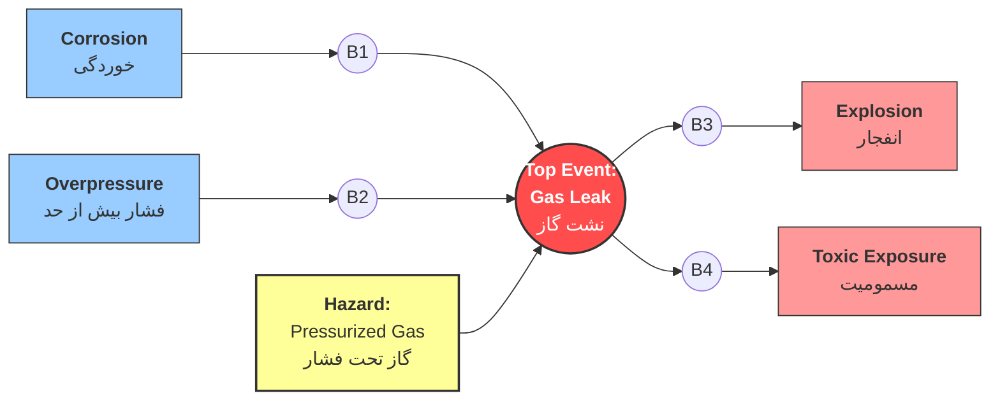

```mermaid
flowchart LR
    T1["<b>Corrosion</b><br>خوردگی"] --> B1(("B1"))
    B1 --> TE(("<b>Top Event:<br>Gas Leak</b><br>نشت گاز"))
    T2["<b>Overpressure</b><br>فشار بیش از حد"] --> B2(("B2"))
    B2 --> TE
    H["<b>Hazard:</b><br>Pressurized Gas<br>گاز تحت فشار"] --> TE
    TE --> B3(("B3")) & B4(("B4"))
    B3 --> C1["<b>Explosion</b><br>انفجار"]
    B4 --> C2["<b>Toxic Exposure</b><br>مسمومیت"]

    style T1 fill:#99ccff,stroke:#333
    style TE fill:#ff4d4d,stroke:#333,stroke-width:2px,color:#fff
    style T2 fill:#99ccff,stroke:#333
    style H fill:#ffff99,stroke:#333,stroke-width:2px
    style C1 fill:#ff9999,stroke:#333
    style C2 fill:#ff9999,stroke:#333
```