# AI-based Bowtie with RAG Engine Analysis

In this case we use [Khazaeeni2006] in our AI-based Bowtie with RAG engine. Following notes used from [Khazaeeni2006] using RAG.

## Output of RAG

To validate the framework, we utilized comprehensive risk documentation from multiple BOT infrastructure projects in Iran. The input text contained detailed analysis of political, economic, and operational risks associated with these complex projects.

### BOT Projects Under Analysis

**Table: BOT Projects Underway in Iran**

| Project Name              | Stage of Work            | Concession Holder Company             |
| ------------------------- | ------------------------ | ------------------------------------- |
| Isfahan South Power Plant | In Operation             | Isfahan South Power Plant Co. (MAPNA) |
| Zanjan Power Plant        | Contract Signed          | MAPNA International & Quest (UAE)     |
| Pars-e-Sar Power Plant    | Under Negotiation        | Consortium led by Edison              |
| Aliabad Power Plant       | Under Negotiation        | OGER (Saudi Arabia)                   |
| Tabriz Power Plant        | Under Negotiation        | ZENEL (Saudi Arabia)                  |
| Shirvan Power Plant       | Under Negotiation        | Sumitomo (Japan)                      |
| Zanjan Power Plants (4-2) | Feasibility Study - BOO* | -                                     |
| Isfahan Power Plants (4)  | Feasibility Study - BOO* | -                                     |

*BOO: Build-Own-Operate

### Risk Documentation Analysis

The risk documentation analyzed contained comprehensive information about various risk categories including political risks (regulatory changes), economic risks (inflation), construction delays, and market uncertainties. The text detailed specific risk mitigation strategies such as risk allocation frameworks, Take-or-pay agreements, and MIGA insurance.

### AI-Generated Bowtie Components

- **Hazard:** Project Failure / Financial Loss
- **Top Event:** Disruption of Operational Continuity
- **Threats:** Political Instability, Economic Inflation, Construction Delays, Regulatory Changes, Market Volatility
- **Preventive Barriers:** Risk Allocation Framework, Take-or-pay Agreements, MIGA Insurance, Comprehensive Risk Assessment, Government Support Mechanisms
- **Consequences:** Stakeholder Bankruptcy, Reputation Damage, Service Disruption, Financial Loss
- **Mitigative Barriers:** Crisis Management Programs, Contract Modification Mechanisms, Insurance Coverage, Diversification Strategies

### Visualization Analysis

The system successfully mapped these entities into a Mermaid flowchart, correctly placing "Take-or-pay agreements" as a preventive barrier against "Economic risks" and "MIGA insurance" as a transference mechanism for political risks. The diagram demonstrated proper causal relationships and logical structure consistent with Bowtie construction best practices.

---

```mermaid
flowchart LR
    subgraph Hazard
        H["<b>شکست پروژه</b><br>زیان‌های مالی سنگین<br>و اختلالات عملیاتی"]
    end

    subgraph Threats
        T1["<b>ریسک‌های سیاسی</b><br>تغییرات قانونی، بی‌ثباتی سیاسی"]
        T2["<b>ریسک‌های اقتصادی</b><br>تورم، نوسانات ارزی، رکود بازار"]
        T3["<b>ریسک‌های قانونی</b><br>تغییر مقررات"]
        T4["<b>ریسک‌های توسعه‌ای</b><br>تأخیر در تأمین مالی"]
        T5["<b>ریسک‌های اجرایی</b><br>تأخیر در ساخت، مشکلات فنی"]
        T6["<b>ریسک‌های بازار</b><br>تغییر تقاضا"]
        T7["<b>ریسک‌های بهره‌برداری</b><br>مشکلات عملیاتی"]
    end

    subgraph Preventive_Barriers
        B1["<b>الگوهای تخصیص ریسک</b><br>بین stakeholders"]
        B2["<b>توافقنامه‌های قراردادی</b><br>Take-or-pay"]
        B3["<b>مکانیسم‌های بیمه‌ای</b><br>MIGA"]
        B4["<b>ارزیابی ریسک جامع</b><br>و برنامه‌ریزی"]
        B5["<b>ساختارهای حاکمیتی</b><br>و توافق‌نامه‌های سهامداران"]
        B6["<b>استراتژی‌های اجتناب</b><br>و کاهش ریسک"]
    end

    subgraph Top_Event
        TE[("<b>Top Event</b><br>شکست پروژه BOT")]
    end

    subgraph Mitigative_Barriers
        M1["<b>برنامه‌های کنترل ریسک</b><br>و مدیریت بحران"]
        M2["<b>پوشش‌های بیمه‌ای</b><br>و حمایت مالی"]
        M3["<b>مکانیسم‌های اصلاح قرارداد</b><br>مثلاً اصلاح عوارض"]
        M4["<b>توافق‌نامه‌های مشارکت ریسک</b>"]
        M5["<b>برنامه‌های پذیرش ریسک</b>"]
    end

    subgraph Consequences
        C1["<b>زیان‌های مالی سنگین</b>"]
        C2["<b>تأخیر یا لغو پروژه</b>"]
        C3["<b>آسیب به اعتبار stakeholders</b>"]
        C4["<b>اختلال در خدمات زیربنایی</b>"]
        C5["<b>disputes قانونی</b>"]
        C6["<b>تأثیرات اجتماعی و اقتصادی</b>"]
    end

    subgraph Digital_Twin_AI
        DT["<b>Digital Twin & AI Intelligence Layer</b>"]
        DT1["<b>Physics-based Digital Twin</b>"]
        DT2["<b>Real-time Sensor Integration</b>"]
        DT3["<b>Degradation Prediction Models</b>"]
        DT4["<b>What-if Scenario Engine</b>"]
        AI1["<b>Adaptive Risk Allocation</b>"]
        AI2["<b>Smart Insurance Activation</b>"]
        AI3["<b>Risk Mitigation Recommendations</b>"]
    end

    subgraph Multi_Layer
        L1["<b>Physical/Technical</b><br>زیرساخت‌ها، تجهیزات"]
        L2["<b>Control & Instrumentation</b><br>سیستم‌های کنترل، ایمنی"]
        L3["<b>Human & Organizational</b><br>تیم‌های مدیریت، فرآیندها"]
        L4["<b>Digital/Cyber</b><br>سیستم‌های دیجیتال، داده‌ها"]
        L5["<b>Management & Governance</b><br>ساختارهای حاکمیتی، قوانین"]
    end

    H --> TE
    T1 --> B1
    T2 --> B2
    T3 --> B3
    T4 --> B4
    T5 --> B5
    T6 --> B6
    T7 --> B1
    B1 --> TE
    B2 --> TE
    B3 --> TE
    B4 --> TE
    B5 --> TE
    B6 --> TE
    TE --> M1
    TE --> M2
    TE --> M3
    TE --> M4
    TE --> M5
    M1 --> C1
    M2 --> C2
    M3 --> C3
    M4 --> C4
    M5 --> C5
    M1 --> C6
    M2 --> C6
    M3 --> C6
    M4 --> C6
    M5 --> C6

    DT --> B1
    DT --> B2
    DT --> B3
    DT --> B4
    DT --> B5
    DT --> B6
    DT --> M1
    DT --> M2
    DT --> M3
    DT --> M4
    DT --> M5

    L1 --> B1
    L2 --> B2
    L3 --> B3
    L4 --> B4
    L5 --> B5
    L1 --> M1
    L2 --> M2
    L3 --> M3
    L4 --> M4
    L5 --> M5

    style H fill:#ffff99,stroke:#333,stroke-width:2px
    style T1 fill:#99ccff,stroke:#333
    style T2 fill:#99ccff,stroke:#333
    style T3 fill:#99ccff,stroke:#333
    style T4 fill:#99ccff,stroke:#333
    style T5 fill:#99ccff,stroke:#333
    style T6 fill:#99ccff,stroke:#333
    style T7 fill:#99ccff,stroke:#333
    style B1 fill:#90ee90,stroke:#333
    style B2 fill:#90ee90,stroke:#333
    style B3 fill:#90ee90,stroke:#333
    style B4 fill:#90ee90,stroke:#333
    style B5 fill:#90ee90,stroke:#333
    style B6 fill:#90ee90,stroke:#333
    style TE fill:#ff4d4d,stroke:#333,stroke-width:2px,color:#fff
    style M1 fill:#ffa64d,stroke:#333
    style M2 fill:#ffa64d,stroke:#333
    style M3 fill:#ffa64d,stroke:#333
    style M4 fill:#ffa64d,stroke:#333
    style M5 fill:#ffa64d,stroke:#333
    style C1 fill:#ff9999,stroke:#333
    style C2 fill:#ff9999,stroke:#333
    style C3 fill:#ff9999,stroke:#333
    style C4 fill:#ff9999,stroke:#333
    style C5 fill:#ff9999,stroke:#333
    style C6 fill:#ff9999,stroke:#333
    style DT fill:#dda0dd,stroke:#333,stroke-dasharray: 5 5
    style DT1 fill:#dda0dd,stroke:#333,stroke-dasharray: 5 5
    style DT2 fill:#dda0dd,stroke:#333,stroke-dasharray: 5 5
    style DT3 fill:#dda0dd,stroke:#333,stroke-dasharray: 5 5
    style DT4 fill:#dda0dd,stroke:#333,stroke-dasharray: 5 5
    style AI1 fill:#dda0dd,stroke:#333,stroke-dasharray: 5 5
    style AI2 fill:#dda0dd,stroke:#333,stroke-dasharray: 5 5
    style AI3 fill:#dda0dd,stroke:#333,stroke-dasharray: 5 5
    style L1 fill:#e6e6fa,stroke:#333
    style L2 fill:#e6e6fa,stroke:#333
    style L3 fill:#e6e6fa,stroke:#333
    style L4 fill:#e6e6fa,stroke:#333
    style L5 fill:#e6e6fa,stroke:#333
```

## References

Khazaeeni, G., & Ahmadi, L. (2006). Risk management in mega-projects with the BOT approach. *Proceedings of the 2nd International Project Management Conference*.

