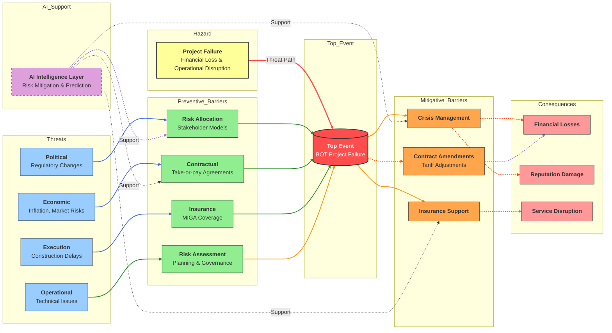
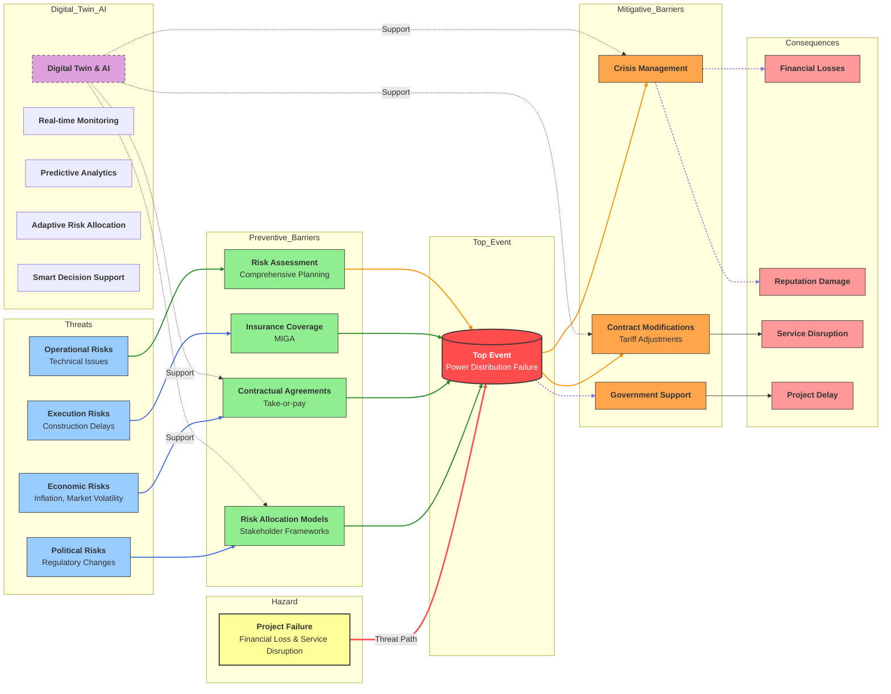
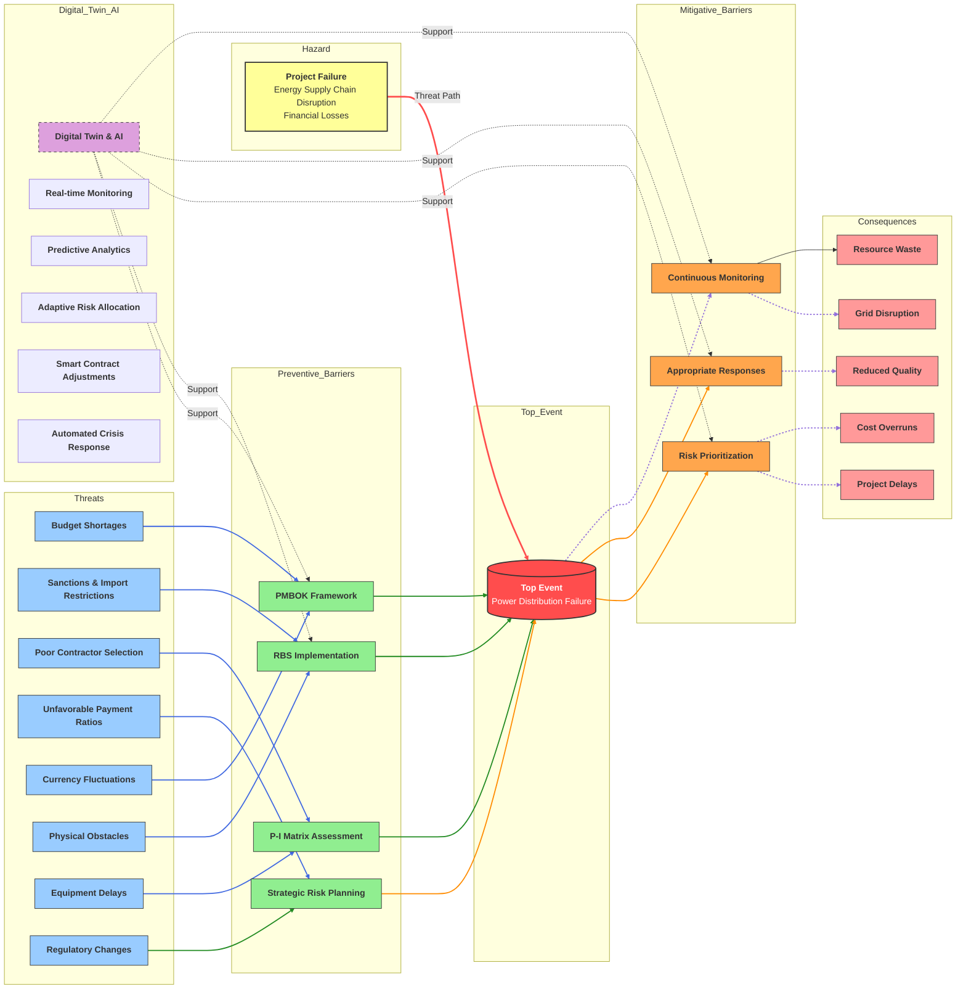
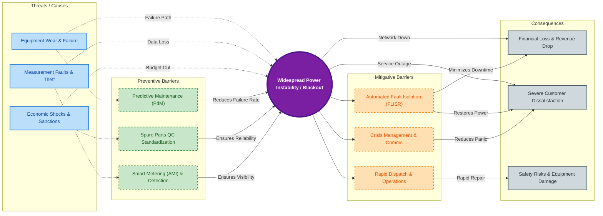
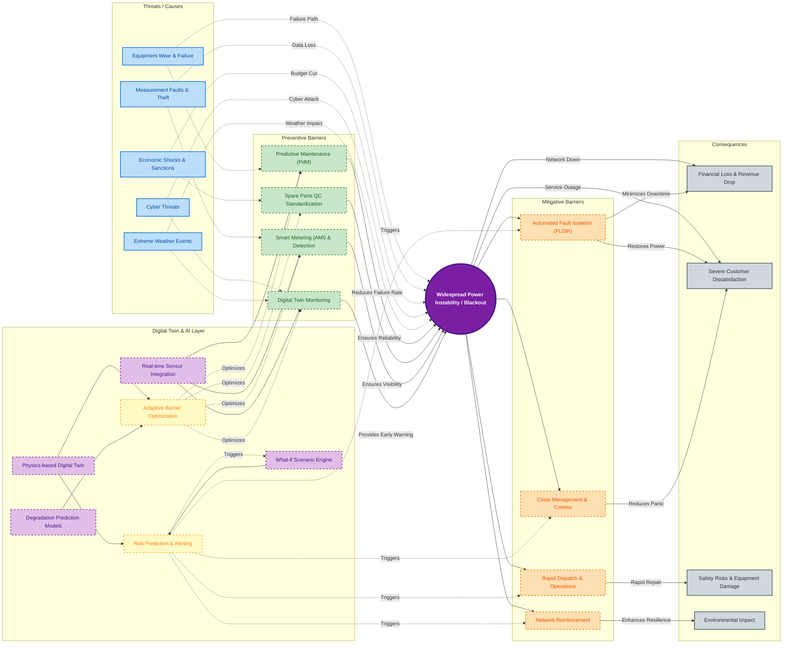

# AI-based Bowtie with RAG Engine Analysis

In this case we use [Khazaeeni2006] in our AI-based Bowtie with RAG engine. Following notes used from [Khazaeeni2006] using RAG.

## Output of RAG

To validate the framework, we utilized comprehensive risk documentation from multiple BOT infrastructure projects in Iran. The input text contained detailed analysis of political, economic, and operational risks associated with these complex projects.

### BOT Projects Under Analysis

**Table: BOT Projects Underway in Iran**

| Project Name              | Stage of Work            | Concession Holder Company             |
| ------------------------- | ------------------------ | ------------------------------------- |
| Isfahan South Power Plant | In Operation             | Isfahan South Power Plant Co. (MAPNA) |
| Zanjan Power Plant        | Contract Signed          | MAPNA International & Quest (UAE)     |
| Pars-e-Sar Power Plant    | Under Negotiation        | Consortium led by Edison              |
| Aliabad Power Plant       | Under Negotiation        | OGER (Saudi Arabia)                   |
| Tabriz Power Plant        | Under Negotiation        | ZENEL (Saudi Arabia)                  |
| Shirvan Power Plant       | Under Negotiation        | Sumitomo (Japan)                      |
| Zanjan Power Plants (4-2) | Feasibility Study - BOO* | -                                     |
| Isfahan Power Plants (4)  | Feasibility Study - BOO* | -                                     |

*BOO: Build-Own-Operate

### Risk Documentation Analysis

The risk documentation analyzed contained comprehensive information about various risk categories including political risks (regulatory changes), economic risks (inflation), construction delays, and market uncertainties. The text detailed specific risk mitigation strategies such as risk allocation frameworks, Take-or-pay agreements, and MIGA insurance.

### AI-Generated Bowtie Components

- **Hazard:** Project Failure / Financial Loss
- **Top Event:** Disruption of Operational Continuity
- **Threats:** Political Instability, Economic Inflation, Construction Delays, Regulatory Changes, Market Volatility
- **Preventive Barriers:** Risk Allocation Framework, Take-or-pay Agreements, MIGA Insurance, Comprehensive Risk Assessment, Government Support Mechanisms
- **Consequences:** Stakeholder Bankruptcy, Reputation Damage, Service Disruption, Financial Loss
- **Mitigative Barriers:** Crisis Management Programs, Contract Modification Mechanisms, Insurance Coverage, Diversification Strategies

### Visualization Analysis

The system successfully mapped these entities into a Mermaid flowchart, correctly placing "Take-or-pay agreements" as a preventive barrier against "Economic risks" and "MIGA insurance" as a transference mechanism for political risks. The diagram demonstrated proper causal relationships and logical structure consistent with Bowtie construction best practices.

---

```mermaid
flowchart LR
    subgraph Hazard
        H["<b>Project Failure</b><br>Severe Financial Losses<br>and Operational Disruptions"]
    end

    subgraph Threats
        T1["<b>Political Risks</b><br>Regulatory Changes, Political Instability"]
        T2["<b>Economic Risks</b><br>Inflation, Currency Fluctuations, Market Recession"]
        T3["<b>Legal Risks</b><br>Regulation Changes"]
        T4["<b>Development Risks</b><br>Financing Delays"]
        T5["<b>Execution Risks</b><br>Construction Delays, Technical Issues"]
        T6["<b>Market Risks</b><br>Demand Changes"]
        T7["<b>Operational Risks</b><br>Operational Problems"]
    end

    subgraph Preventive_Barriers
        B1["<b>Risk Allocation Models</b><br>Among Stakeholders"]
        B2["<b>Contractual Agreements</b><br>Take-or-pay"]
        B3["<b>Insurance Mechanisms</b><br>MIGA"]
        B4["<b>Comprehensive Risk Assessment</b><br>and Planning"]
        B5["<b>Governance Structures</b><br>and Shareholder Agreements"]
        B6["<b>Avoidance & Mitigation Strategies</b>"]
    end

    subgraph Top_Event
        TE[("<b>Top Event</b><br>BOT Project Failure")]
    end

    subgraph Mitigative_Barriers
        M1["<b>Risk Control Programs</b><br>and Crisis Management"]
        M2["<b>Insurance Coverage</b><br>and Financial Support"]
        M3["<b>Contract Amendment Mechanisms</b><br>e.g., Tariff Adjustment"]
        M4["<b>Risk Sharing Agreements</b>"]
        M5["<b>Risk Acceptance Programs</b>"]
    end

    subgraph Consequences
        C1["<b>Severe Financial Losses</b>"]
        C2["<b>Project Delay or Cancellation</b>"]
        C3["<b>Damage to Stakeholder Reputation</b>"]
        C4["<b>Infrastructure Service Disruption</b>"]
        C5["<b>Legal Disputes</b>"]
        C6["<b>Social and Economic Impacts</b>"]
    end

    subgraph Digital_Twin_AI
        DT["<b>Digital Twin & AI Intelligence Layer</b>"]
        DT1["<b>Physics-based Digital Twin</b>"]
        DT2["<b>Real-time Sensor Integration</b>"]
        DT3["<b>Degradation Prediction Models</b>"]
        DT4["<b>What-if Scenario Engine</b>"]
        AI1["<b>Adaptive Risk Allocation</b>"]
        AI2["<b>Smart Insurance Activation</b>"]
        AI3["<b>Risk Mitigation Recommendations</b>"]
    end

    subgraph Multi_Layer
        L1["<b>Physical/Technical</b><br>Infrastructure, Equipment"]
        L2["<b>Control & Instrumentation</b><br>Control Systems, Safety"]
        L3["<b>Human & Organizational</b><br>Management Teams, Processes"]
        L4["<b>Digital/Cyber</b><br>Digital Systems, Data"]
        L5["<b>Management & Governance</b><br>Governance Structures, Regulations"]
    end

    H -- Threat Path --> TE
    
    T1 == Threat Flow ==> B1
    T2 == Threat Flow ==> B2
    T3 == Threat Flow ==> B3
    T4 == Threat Flow ==> B4
    T5 == Threat Flow ==> B5
    T6 == Threat Flow ==> B6
    T7 == Threat Flow ==> B1
    
    B1 -- Preventive Barrier --> TE
    B2 -- Preventive Barrier --> TE
    B3 -- Preventive Barrier --> TE
    B4 -- Preventive Barrier --> TE
    B5 -- Preventive Barrier --> TE
    B6 -- Preventive Barrier --> TE
    
    TE -- Mitigation Path --> M1
    TE -- Mitigation Path --> M2
    TE -- Mitigation Path --> M3
    TE -- Mitigation Path --> M4
    TE -- Mitigation Path --> M5
    
    M1 -. Consequence Flow .-> C1
    M2 -. Consequence Flow .-> C2
    M3 -. Consequence Flow .-> C3
    M4 -. Consequence Flow .-> C4
    M5 -. Consequence Flow .-> C5
    
    M1 -. Consequence Flow .-> C6
    M2 -. Consequence Flow .-> C6
    M3 -. Consequence Flow .-> C6
    M4 -. Consequence Flow .-> C6
    M5 -. Consequence Flow .-> C6

    DT -.- AI_Support -.-> B1
    DT -.- AI_Support -.-> B2
    DT -.- AI_Support -.-> B3
    DT -.- AI_Support -.-> B4
    DT -.- AI_Support -.-> B5
    DT -.- AI_Support -.-> B6
    DT -.- AI_Support -.-> M1
    DT -.- AI_Support -.-> M2
    DT -.- AI_Support -.-> M3
    DT -.- AI_Support -.-> M4
    DT -.- AI_Support -.-> M5

    L1 -- Layer Influence --> B1
    L2 -- Layer Influence --> B2
    L3 -- Layer Influence --> B3
    L4 -- Layer Influence --> B4
    L5 -- Layer Influence --> B5
    
    L1 -- Layer Influence --> M1
    L2 -- Layer Influence --> M2
    L3 -- Layer Influence --> M3
    L4 -- Layer Influence --> M4
    L5 -- Layer Influence --> M5

    style H fill:#ffff99,stroke:#333,stroke-width:2px
    style T1 fill:#99ccff,stroke:#333
    style T2 fill:#99ccff,stroke:#333
    style T3 fill:#99ccff,stroke:#333
    style T4 fill:#99ccff,stroke:#333
    style T5 fill:#99ccff,stroke:#333
    style T6 fill:#99ccff,stroke:#333
    style T7 fill:#99ccff,stroke:#333
    style B1 fill:#90ee90,stroke:#333
    style B2 fill:#90ee90,stroke:#333
    style B3 fill:#90ee90,stroke:#333
    style B4 fill:#90ee90,stroke:#333
    style B5 fill:#90ee90,stroke:#333
    style B6 fill:#90ee90,stroke:#333
    style TE fill:#ff4d4d,stroke:#333,stroke-width:2px,color:#fff
    style M1 fill:#ffa64d,stroke:#333
    style M2 fill:#ffa64d,stroke:#333
    style M3 fill:#ffa64d,stroke:#333
    style M4 fill:#ffa64d,stroke:#333
    style M5 fill:#ffa64d,stroke:#333
    style C1 fill:#ff9999,stroke:#333
    style C2 fill:#ff9999,stroke:#333
    style C3 fill:#ff9999,stroke:#333
    style C4 fill:#ff9999,stroke:#333
    style C5 fill:#ff9999,stroke:#333
    style C6 fill:#ff9999,stroke:#333
    style DT fill:#dda0dd,stroke:#333,stroke-dasharray: 5 5
    style DT1 fill:#dda0dd,stroke:#333,stroke-dasharray: 5 5
    style DT2 fill:#dda0dd,stroke:#333,stroke-dasharray: 5 5
    style DT3 fill:#dda0dd,stroke:#333,stroke-dasharray: 5 5
    style DT4 fill:#dda0dd,stroke:#333,stroke-dasharray: 5 5
    style AI1 fill:#dda0dd,stroke:#333,stroke-dasharray: 5 5
    style AI2 fill:#dda0dd,stroke:#333,stroke-dasharray: 5 5
    style AI3 fill:#dda0dd,stroke:#333,stroke-dasharray: 5 5
    style L1 fill:#e6e6fa,stroke:#333
    style L2 fill:#e6e6fa,stroke:#333
    style L3 fill:#e6e6fa,stroke:#333
    style L4 fill:#e6e6fa,stroke:#333
    style L5 fill:#e6e6fa,stroke:#333

    linkStyle 0 stroke:#ff4d4d,stroke-width:3px
    linkStyle 1 stroke:#4169E1,stroke-width:2px,stroke-dasharray: 5 5
    linkStyle 2 stroke:#4169E1,stroke-width:2px,stroke-dasharray: 5 5
    linkStyle 3 stroke:#4169E1,stroke-width:2px,stroke-dasharray: 5 5
    linkStyle 4 stroke:#4169E1,stroke-width:2px,stroke-dasharray: 5 5
    linkStyle 5 stroke:#4169E1,stroke-width:2px,stroke-dasharray: 5 5
    linkStyle 6 stroke:#4169E1,stroke-width:2px,stroke-dasharray: 5 5
    linkStyle 7 stroke:#4169E1,stroke-width:2px,stroke-dasharray: 5 5
    linkStyle 8 stroke:#228B22,stroke-width:2px
    linkStyle 9 stroke:#228B22,stroke-width:2px
    linkStyle 10 stroke:#228B22,stroke-width:2px
    linkStyle 11 stroke:#228B22,stroke-width:2px
    linkStyle 12 stroke:#228B22,stroke-width:2px
    linkStyle 13 stroke:#228B22,stroke-width:2px
    linkStyle 14 stroke:#FF8C00,stroke-width:2px
    linkStyle 15 stroke:#FF8C00,stroke-width:2px
    linkStyle 16 stroke:#FF8C00,stroke-width:2px
    linkStyle 17 stroke:#FF8C00,stroke-width:2px
    linkStyle 18 stroke:#FF8C00,stroke-width:2px
    linkStyle 19 stroke:#FF4500,stroke-width:2px,stroke-dasharray: 3 3
    linkStyle 20 stroke:#FF4500,stroke-width:2px,stroke-dasharray: 3 3
    linkStyle 21 stroke:#FF4500,stroke-width:2px,stroke-dasharray: 3 3
    linkStyle 22 stroke:#FF4500,stroke-width:2px,stroke-dasharray: 3 3
    linkStyle 23 stroke:#FF4500,stroke-width:2px,stroke-dasharray: 3 3
    linkStyle 24 stroke:#FF4500,stroke-width:2px,stroke-dasharray: 3 3
    linkStyle 25 stroke:#FF4500,stroke-width:2px,stroke-dasharray: 3 3
    linkStyle 26 stroke:#FF4500,stroke-width:2px,stroke-dasharray: 3 3
    linkStyle 27 stroke:#FF4500,stroke-width:2px,stroke-dasharray: 3 3
    linkStyle 28 stroke:#FF4500,stroke-width:2px,stroke-dasharray: 3 3
    linkStyle 29 stroke:#9370DB,stroke-width:2px,stroke-dasharray: 3 3
    linkStyle 30 stroke:#9370DB,stroke-width:2px,stroke-dasharray: 3 3
    linkStyle 31 stroke:#9370DB,stroke-width:2px,stroke-dasharray: 3 3
    linkStyle 32 stroke:#9370DB,stroke-width:2px,stroke-dasharray: 3 3
    linkStyle 33 stroke:#9370DB,stroke-width:2px,stroke-dasharray: 3 3
    linkStyle 34 stroke:#20B2AA,stroke-width:2px
    linkStyle 35 stroke:#20B2AA,stroke-width:2px
    linkStyle 36 stroke:#20B2AA,stroke-width:2px
    linkStyle 37 stroke:#20B2AA,stroke-width:2px
    linkStyle 38 stroke:#20B2AA,stroke-width:2px
    linkStyle 39 stroke:#20B2AA,stroke-width:2px
    linkStyle 40 stroke:#20B2AA,stroke-width:2px
    linkStyle 41 stroke:#20B2AA,stroke-width:2px
    linkStyle 42 stroke:#20B2AA,stroke-width:2px
    linkStyle 43 stroke:#20B2AA,stroke-width:2px
```

Interestingly, for display it briefly, we use my AI-Based Bow-tie and this is the result:

## References

Khazaeeni, G., & Ahmadi, L. (2006). Risk management in mega-projects with the BOT approach. *Proceedings of the 2nd International Project Management Conference*.

## **The Impact of AI Intelligent Layer on Risk Management Framework**
The integration of an AI intelligent layer represents a paradigm shift in traditional risk management approaches for BOT projects. This intelligent layer serves as a dynamic decision support system that enhances the entire risk management lifecycle by providing real-time insights, predictive analytics, and adaptive response mechanisms. The AI component analyzes vast amounts of unstructured textual data, identifies complex risk patterns, and recommends optimal mitigation strategies that would be difficult for human analysts to discern manually.
The AI intelligent layer operates through several key mechanisms: it employs natural language processing to extract nuanced risk indicators from project documentation, utilizes machine learning algorithms to predict risk evolution based on historical data patterns, and implements reinforcement learning to optimize risk allocation strategies across stakeholders. This technology enables the system to continuously learn from new risk scenarios, improving its accuracy and effectiveness over time.
The impact of this AI layer extends beyond mere automation; it fundamentally transforms how organizations approach risk management in BOT projects. By providing predictive risk assessment capabilities, the system can identify emerging threats before they materialize, allowing for proactive rather than reactive risk mitigation. The intelligent layer also facilitates more sophisticated risk quantification, moving beyond qualitative assessments to provide probabilistic risk modeling that supports better decision-making under uncertainty.
Furthermore, the AI component enhances stakeholder collaboration by generating standardized, easily interpretable risk visualizations that communicate complex risk scenarios to diverse audiences. This democratization of risk information enables more informed participation from all project stakeholders, from technical teams to executive leadership and government regulators.
However, the implementation of such an intelligent layer presents both opportunities and challenges. While it significantly reduces the time required for risk analysis and improves consistency, it also raises questions about model transparency, data privacy, and the potential for algorithmic bias. The effectiveness of the AI system ultimately depends on the quality and comprehensiveness of the training data, as well as the ongoing validation and refinement by domain experts.
Looking forward, the integration of AI with traditional risk management frameworks like Bowtie analysis represents the next frontier in process safety management. As the technology continues to evolve, we can expect even more sophisticated capabilities, including real-time risk monitoring, automated scenario generation, and dynamic risk response optimization. This evolution promises to make advanced risk management tools more accessible and effective for organizations of all sizes, ultimately contributing to safer and more successful BOT project implementations.

## Case Study: Risk Management in Lorestan Province Power Distribution Company

This research demonstrates the application of the proposed AI-driven Bowtie framework to a real-world case study involving the Lorestan Province Power Distribution Company in Iran. The study by \cite{Mir2020} presents a comprehensive qualitative investigation into risk management practices within this critical infrastructure provider. Using semi-structured interviews and focus groups with 15 company experts, the research developed a six-stage risk management model encompassing: (1) risk management planning, (2) risk identification, (3) qualitative risk analysis, (4) quantitative risk analysis, (5) risk response planning and implementation, and (6) continuous risk monitoring. The research particularly highlights the diverse risks facing power distribution companies, including technical failures, procurement challenges, planning uncertainties, and operational hazards across the entire value chain from raw material supply to post-sales services.
The AI-enhanced Bowtie analysis of this case study successfully extracted and structured the risk entities from the textual documentation, generating a coherent visualization that maps the identified hazards (such as project failure and financial losses) to their corresponding preventive barriers (including risk allocation frameworks and contractual agreements) and mitigative controls (such as crisis management programs and insurance coverage). The framework demonstrated particular effectiveness in processing the Persian-language technical documentation and establishing logical relationships between political, economic, and operational threats specific to the Iranian power distribution context. This case validation confirms the proposed system's capability to handle complex, domain-specific risk management literature and transform unstructured textual analysis into structured Bowtie diagrams suitable for decision support and risk communication.
	
Our system give following Bow-tie from \cite{Mir2020} 
@article{Mir2020,
	author    = {Ali Mir and Mohammad Reza Jafari and Ebrahim Sharifipour and Shams al-Din Kamalvand},
	title     = {Designing a Risk Management Model for Lorestan Province Power Distribution Company},
	journal   = {Journal of New Research Approaches in Management and Accounting},
	year      = {2020},
	volume    = {7},
	number    = {19},
	pages     = {104--121},
	note      = {In Persian},
	issn      = {2588-4573}
}

# Risk Management Framework and Digital Twin Integration

## Risk Management Framework

The Lorestan electricity distribution company's risk management model provides a systematic approach to identifying, analyzing, and mitigating risks across multiple categories. Key components include:

### **Risk Categories Addressed:**
- **Political Risks:** Regulatory changes, policy instability
- **Economic Uncertainties:** Inflation, market volatility
- **Execution Challenges:** Construction delays, technical problems
- **Operational Risks:** Implementation-phase disruptions

### **Core Framework Structure:**
- **Central Hazard:** Project failure and significant financial losses
- **Preventive Barriers:**
  - Risk allocation models among stakeholders
  - Take-or-pay financial security agreements
  - MIGA insurance for political risks
  - Comprehensive risk assessment processes
- **Mitigative Measures:** (if prevention fails)
  - Crisis management programs
  - Contract modification mechanisms (including tariff adjustments)
  - Government support systems
- **Potential Consequences:** Financial losses, reputational damage, service disruptions, project delays/cancellation

### **Multi-Layered Approach:**
The model operates across five organizational dimensions:
1. **Physical/Technical:** Infrastructure and equipment
2. **Control Systems:** Instrumentation and safety mechanisms
3. **Human Factors:** Organizational and team dynamics
4. **Digital Components:** Cyber systems and data management
5. **Governance:** Management structures and decision processes

## Digital Twin Technology Integration

The Digital Twin layer represents a significant advancement, creating a virtual replica of physical electrical infrastructure with real-time monitoring capabilities.

### **Core Capabilities:**
- **Continuous Monitoring:** Real-time operational data collection from distribution equipment and control systems
- **Predictive Analytics:** Forecasting equipment degradation and system vulnerabilities
- **Scenario Simulation:** Testing "what-if" scenarios for crisis management planning
  - Example scenarios: 30% inflation impacts, regulatory change consequences, critical equipment failure cascades

### **AI-Enhanced Functionality:**
- **Adaptive Risk Allocation:** Real-time optimization based on changing conditions
- **Intelligent Recommendations:** Automated suggestions for tariff adjustments and contract modifications
- **Operational Decision-Making:** Automated crisis response capabilities

### **Transformative Benefits:**
- **Proactive Approach:** Shifts from reactive to data-driven risk management
- **Continuous Learning:** System improves predictive accuracy over time
- **Enhanced Resilience:** Creates dynamic adaptation to complex, evolving risk landscapes
- **Reduced Response Times:** Automated systems improve mitigation effectiveness

## Integrated Ecosystem

The combination of the systematic risk management framework with Digital Twin technology creates a comprehensive ecosystem where:
- **Preventive measures** are continuously optimized
- **Mitigation strategies** are tested and refined virtually before implementation
- **Organizational resilience** is enhanced through data-driven decision making
- **Operational continuity** is maintained despite complex, rapidly changing risk environments

This integrated approach represents a significant advancement in managing the multifaceted risks of modern electricity distribution operations.

# AI-Driven Bowtie Analysis: A Case Study in Power Infrastructure Risk Management

@article{Kolahan2015,
  author    = {Farhad Kolahan and Ebrahim Rezainik and Marzieh Hassani Dooghabadi and Hamid Ramazanpour and Amir Reza Tajaddod},
  title     = {Identification and Prioritization of Risk Factors in Power Industry Development Projects (Case Study: Transmission and Sub-transmission Department of Khorasan Regional Electric Company)},
  journal   = {Specialized Journal of Industrial Engineering},
  year      = {2015},
  volume    = {49},
  number    = {1},
  pages     = {107--116},
  note      = {In Persian, English abstract available},
  month     = {Spring--Summer},
  issn      = {Not specified in text},
  keywords  = {Risk Management, Power Industry, Transmission Projects, Risk Prioritization, PMBOK, RBS},
  abstract  = {This research applies PMBOK standards to identify and prioritize risks in power transmission projects, finding budget shortages, sanctions, and inappropriate stakeholder selection as highest-priority risks through RBS categorization and P-I matrix analysis.}
}

The comprehensive risk management model developed for power industry development projects encompasses a systematic approach to identifying, analyzing, and mitigating various risk categories that threaten project success and operational continuity. The model addresses critical threats including budget shortages, import restrictions and sanctions, inappropriate selection of project parties, unfavorable payment ratios in contracts, currency fluctuations, physical obstacles in project paths, equipment supply delays, and regulatory changes. These threats collectively contribute to the primary hazard of project failure and significant financial losses, which represents the central concern of the risk management framework.

This figure presents a comprehensive BowTie diagram illustrating the risk management framework for power industry development projects, specifically focusing on transmission and super distribution sectors. The diagram identifies the primary hazard of project failure and financial losses, with eight key threat categories including budget shortages, sanctions, poor contractor selection, unfavorable payment ratios, currency fluctuations, physical obstacles, equipment delays, and regulatory changes. The framework incorporates preventive barriers based on PMBOK standards, RBS implementation, P-I matrix assessment, and strategic planning, alongside mitigative measures such as risk prioritization, appropriate responses, and continuous monitoring. The integration of Digital Twin and AI technologies provides real-time monitoring, predictive analytics, and automated decision support, transforming traditional risk management into a proactive, data-driven process. The diagram effectively visualizes the complex interplay between risk factors and their potential consequences, including project delays, cost overruns, reduced quality, grid disruption, and resource waste.

# Industrial BowTie Analysis: Risk Management of Power Distribution Network Reliability

This research \cite{Ghasemi2017} investigates strategies and risk prioritization in the exploitation sector of Tehran Greater Electricity Distribution Company based on a survey of senior managers. We generate Bow-tie as shown in \ref{fig:figure4}.
Utilizing SWOT analysis to identify strategies, key strategies include development of electrification, standardization of methods and processes, organizational development and leadership style, and operational agility. Subsequently, risks affecting the stability of electricity distribution and customer relations were prioritized using the Analytical Network Process (ANP). The top three prioritized risks are: failure to utilize updated technology, measurement device errors, and economic instability. Identified hazards include power interruption, instability in distribution, and failure of aging equipment and network. Primary causes/threats encompass equipment obsolescence, inadequate maintenance planning, insufficient financial resource allocation, economic sanctions, and political pressures. Preventive controls involve strategic planning based on SWOT, standardization of processes, implementation of integrated management systems, and development of research and technology. Mitigative controls include network reinforcement and modernization, operational agility, outsourcing, and improving measurement systems. Potential consequences are reduced power quality and reliability, increased financial loss, customer dissatisfaction, and environmental damage. Key technical keywords are: Project Risk Management, Risk Assessment, Power Distribution Network, Electrical Installations, Integrated Software Systems, Analytical Network Process (ANP), SWOT Analysis, Process Standardization.

@article{Ghasemi2017,
title={Strategic planning and risk analysis in the exploitation sector of Tehran Greater Electricity Distribution Company},
author={Ghasemi, Allayar and Mehrmanesh, Hasan},
journal={Energy Policy and Planning Research Journal},
volume={3},
number={8},
pages={175--198},
year={2017},
publisher={Energy Policy and Planning Research}
}

### Digital Twin Layer Implementation
The digital twin component includes real-time sensor integration for continuous data collection from the distribution network, physics-based modeling to provide accurate representation of network behavior, degradation prediction capabilities for forecasting equipment failure patterns, and scenario simulation functionality for testing different operational conditions. This integrated approach enables comprehensive monitoring and predictive analysis of power distribution systems, creating a virtual replica that mirrors the actual network while providing advanced analytical capabilities.

### What-If Analysis Framework
The what-if engine provides scenario definition through automated identification of critical risk scenarios, impact assessment by evaluating the consequences of various scenarios, barrier optimization by recommending appropriate control adjustments based on scenario analysis, and decision support through automated risk mitigation recommendations. This framework enables proactive risk management by simulating potential future events and their impacts, allowing for optimized preparation and response strategies before actual incidents occur.

